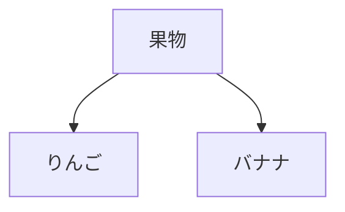

# AIで要件定義書を作成する

この章では、**開発フロー全体でAIを最大限活用する方法**を学びます。そのための最初のステップが、**マークダウンで要件定義書を作成すること**です。

## マークダウンとは

**マークダウン**は、テキストに簡単な記号を使って見出しや箇条書きを表現する記法です。

### マークダウンの基本記法

**見出し：**
```markdown
# 見出し1（最上位）
## 見出し2
### 見出し3
```

**箇条書き：**
```markdown
- 箇条書き1
- 箇条書き2
- 箇条書き3
```

**番号付きリスト：**
```markdown
1. 番号付きリスト1
2. 番号付きリスト2
```

**強調：**
```markdown
**太字**
*斜体*
```

**コードブロック：**
````markdown
```javascript
console.log("コードブロック");
```
````


## なぜマークダウンで要件定義書を書くのか

### AI駆動開発における開発フローの全体像

従来の開発では、各フェーズのドキュメントをExcelなどで管理していました。

```
要件定義 → 設計 → 実装 → テスト
（Excelなどで管理）
```

AI駆動開発では、**AIで各フェーズをシームレスにつなぐのが理想です**。

```
要件定義書.md
    ↓ AIに渡して設計書を生成
設計書.md
    ↓ AIに渡してコードを生成
コード
    ↓ AIに渡してテストを生成
テストコード
```

しかし、これを実現するには、**AIが理解できる形式でドキュメントを管理する**必要があります。その最適な形式が、**マークダウン**です。

### ExcelやWordの問題点

従来の開発現場では、要件定義書をExcelやWordで作成するのが一般的でした。しかし、**AI駆動開発では、ExcelやWordは不向き**です。

その理由は、**ExcelやWordは、AIが正確に読み取れない**からです。
一応、読み込むことは出来るものの、精度がかなり落ちます。

マークダウンなら、**純粋なテキストファイル**なので、AIが100%正確に理解できます。

でも、マークダウンだと図が書けないよね？と思っている方、安心してください。
マークダウンでも図が書けます

#### マークダウンで図を描く（Mermaid）

マークダウンには、**Mermaid**という図を描く機能があります。

**Mermaid**は、テキストで図を描ける記法です。例えば、以下のコードを書くと：

````

````

このような図が自動生成されます：


#### 一部Excelと併用しても良い
ただし場合によっては、マークダウンよりもExcelの方が便利な時もあります。そういう時は部分的にExcelを併用するのもオススメです。

なお、Excelをマークダウンに変換したい時は、ExcelをHTMLに変換し、HTMLをマークダウンに変換するのが最も変換成功率が高いです。

#### Gitにコミットしよう

マークダウンでドキュメントを作成したら、今後はそれをAIに読み込ませながらAI駆動開発を進めるので、ソースコードと同じGitリポジトリに、マークダウン一式もコミットしましょう。フォルダはdocs/フォルダなど、どこでも構いません

**結論：AI駆動開発では、マークダウンでドキュメント管理して、Gitにコミットするのがオススメ**

## マークダウンで要件定義書を作ってみよう

ここでは、**ECサイト構築**を例に、**AIと対話しながら要件定義を進める実践的な流れ**を紹介します。

### ステップ1：AIに要件定義書の雛形を作ってもらう

まず、要件定義書作成はCursorを使うのがオススメです。
CursorのAIチャットを起動し、以下のようにプロンプトを入力します：

```
あなたはシステムエンジニアで要件定義のエキスパートです。

docs/要件定義書.mdに、ECサイトの要件定義書をマークダウンで作成してください。

以下の機能を含めてください：
- 商品の検索・一覧表示
- ショッピングカート機能
- 決済機能
- 注文履歴表示

```

すると、以下のような内容が作成されます
```markdown
# 要件定義書：ECサイト

## 1. プロジェクト概要

### 目的
オンラインで商品を販売し、顧客が簡単に購入できるECサイトを構築する。

## 2. 機能要件

### 2.1 商品の検索・一覧表示

#### 詳細説明
商品をカテゴリやキーワードで検索し、一覧表示する機能。

#### 機能詳細
- キーワード検索
- カテゴリ別表示

### 2.2 ショッピングカート機能

#### 詳細説明
商品をカートに追加し、数量変更や削除ができる機能。

#### 機能詳細
- カートに商品を追加
- カートから削除
...
```

### ステップ2：AIと対話しながら詳細化する

ここからが**AIと対話する本番**です。

生成された要件定義書を見ながら、**「これで本当に実装できるか？」**を考えます。そして、足りない部分をAIに質問しながら詰めていきます。

#### 対話例1：機能の詳細を考えてもらう

```
あなた：
「決済機能について、どの決済方法に対応すべきか教えて」

AI：
「以下の決済方法が一般的です：
- クレジットカード（Stripe、PayPal）
- コンビニ決済
- 銀行振込
- 代金引換

初期リリースでは、クレジットカード決済（Stripe）に絞るのが現実的です。」

あなた：
「それを要件定義書に追記して」
```

#### 対話例2：レビューしてもらう

```
あなた：
「要件定義書が完成したので、他に考慮すべき点がないか、レビューして」
```


このように、**AIに質問しながら、要件を詰めていく**のがAI駆動開発の流れです。

要件定義書はAIでどんどん更新されるので、適宜Gitにコミットしながら進めましょう

## 実際のプロンプトのコツ

### 良いプロンプトの例

```
✅ 具体的で明確
「ECサイトの要件定義書.mdを作成してください。
以下の機能を含めてください：
- 商品の検索・一覧表示（カテゴリ、価格帯でフィルタリング）
- ショッピングカート機能（数量変更、削除）
- 決済機能（クレジットカード、PayPal）
- 注文履歴表示

非機能要件として以下も含めてください：
- レスポンスタイム：平均200ms以内
- 同時接続数：1000ユーザー
- セキュリティ：PCI DSS準拠」
```

### 悪いプロンプトの例

```
❌ 曖昧で不明確
「ECサイトの要件定義書を作って」
→ 具体的な機能が不明
→ 非機能要件が欠落
→ 再度修正が必要になる
```

## 段階的に詳細化する

複雑なシステムの場合、一度に全てを指示せず、段階的に詳細化するのが効果的です。

### ステップ1：大枠を作る

```
プロンプト：
「タスク管理アプリの要件定義書.mdを作成してください。
以下のセクションの見出しだけ作成してください：
- プロジェクト概要
- 機能要件（主要5機能）
- 非機能要件
- 技術要件
- 制約事項」
```

### ステップ2：各セクションを詳細化

```
プロンプト：
「2.1 ユーザー登録・ログイン機能のセクションを詳細化してください。
以下を含めてください：
- 詳細説明
- 機能詳細（箇条書き）
- ユーザーストーリー
- 制約条件」
```

### ステップ3：さらに具体化

```
プロンプト：
「2.1.1 OAuth認証の実装詳細を追加してください。
対応プロバイダ、認可フロー、エラーハンドリングを含めてください。」
```

このように**分割して指示**することで、AIの精度が上がり、修正の手間が減ります。

## 設計書も同様の手順で進める

要件定義書.mdが完成したら、
外部設計書.mdも同様の手順で作成しましょう

## ⚠️大事な心構え

ここで、要件定義フェーズにおける**最も重要なポイント**をお伝えします。

**AIはあくまでサポート役です。**
要件定義を行う主役はAIではなく、あなたです。

AIは要件定義書の作成を手伝ってくれますが、**「どんなシステムを作りたいのか」はAIには分かりません。**

システムを必要としているのは、クライアントやエンドユーザーです。彼らが何を求めているのか、どんな課題を解決したいのか——それを理解し、要件定義にまとめるのは、**今も、そしてこれからも、人間であるあなたの重要な仕事**です。

### あなたの役割

特に要件定義フェーズでは、以下があなたの責任です：

- **クライアントやユーザーのニーズをヒアリングする**
- **本当に解決すべき課題を見極める**
- **曖昧な要望を具体的な要件に落とし込む**

AIに「要件定義書を作って」と丸投げしても、良い要件定義書は作れません。

**あなたがヒアリングし、整理した情報をもとに、AIが文書化を手伝ってくれる**——これが正しいAI駆動開発の姿です。

### AIはあなたの助手。丸投げはNG

AIの役割は、以下のようなサポートです：

- 要件定義書のテンプレートを提案してくれる
- 各機能について深掘りして考えて、あなたに提案してくれる
- 抜け漏れがないかチェックしてくれる
- 技術的な観点からアドバイスをくれる
- マークダウンやMermaid図を素早く作成してくれる

**人間が考え、判断し、AIがサポートする**——この関係性を忘れずに、要件定義に取り組みましょう。

## まとめ

- AI駆動開発では、マークダウン形式でドキュメントを管理しましょう
- AIを駆使して要件定義の生産性を大幅にアップしましょう
- AIはただの助手なので丸投げはNG。要件定義はあなたの仕事です


