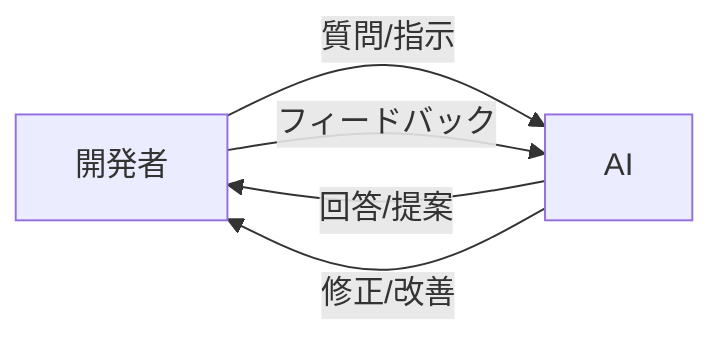
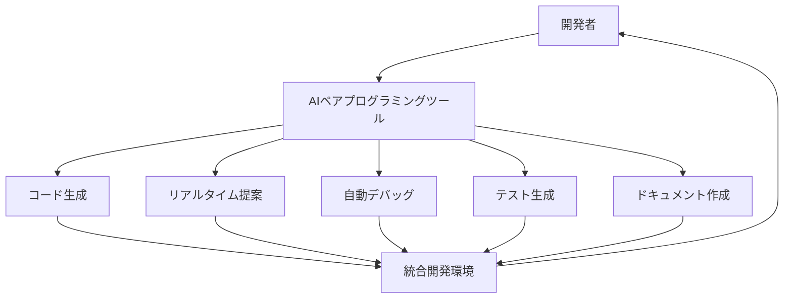

# AIとのペアプログラミング

## ペアプログラミングの新たな形

ペアプログラミングは、2 人の開発者が 1 つのワークステーションで共同作業を行うソフトウェア開発手法として長年実践されてきました。AIの進化により、この概念は新たな段階へと進化しています。「AIとのペアプログラミング」とは、人間の開発者と AIが協力してコードを書き、問題を解決する新しい開発スタイルです。

## AIとのペアプログラミングの利点

AIとのペアプログラミングには、従来のペアプログラミングと比較して、いくつかの独自の利点があります：

### 1. 常時利用可能性



- 時間帯を問わず利用可能
- 休憩や集中力の低下がない
- 複数のプロジェクトで同時に活用可能

### 2. 幅広い知識ベース

- 多様なプログラミング言語やフレームワークに関する知識
- ベストプラクティスやデザインパターンの提案
- 最新の技術トレンドへのアクセス

### 3. バイアスの少ない視点

- 社内政治に影響されない客観的な視点
- 個人的な好みに左右されない提案
- 既存のコードベースに対する新鮮な見方

### 4. 学習と成長の機会

- 新しいテクニックや代替アプローチの学習
- コードの説明を通じた理解の深化
- 異なる視点からの問題解決方法の習得

## AIとのペアプログラミングの実践方法

効果的な AIとのペアプログラミングを実現するためのベストプラクティスを紹介します。

### 1. 明確な目標設定

AIとの効果的な協業のためには、取り組むタスクや解決したい問題を明確に定義することが重要です。

**例**:

```
「ユーザー認証システムにおいて、パスワードリセット機能を実装したい。
要件は以下の通り：
1. ユーザーがメールアドレスを入力
2. 一時トークンを生成してメールで送信
3. トークンを使ってパスワードをリセット
4. 24時間後にトークンを無効化

使用技術：Node.js, Express, MongoDB」
```

### 2. 段階的な作業分解

複雑な問題は小さなステップに分解し、AIと一緒に一つずつ取り組みます。

**ステップ例**:

1. データモデルの設計
2. トークン生成ロジックの実装
3. メール送信機能の統合
4. パスワードリセットエンドポイントの作成
5. トークン有効期限の管理
6. エラーハンドリングとバリデーション

### 3. 効果的なプロンプト技術

AIとのコミュニケーションを最適化するためのプロンプト技術：

**コンテキスト提供**:

```
「以下のUserモデルがあります：
[既存のコード]

このモデルにパスワードリセットトークンのフィールドとメソッドを追加したいです。」
```

**制約条件の明示**:

```
「このコードは本番環境で実行されるため、セキュリティに特に注意して
実装してください。また、パフォーマンスも考慮し、不要なデータベース
クエリを最小限に抑えるようにしてください。」
```

**部分的なガイダンス**:

```
「トークン生成には crypto モジュールを使用し、ランダムな文字列を
生成したいですが、具体的な実装方法についてアドバイスをください。」
```

### 4. コードレビューとリファクタリング

AIとのペアプログラミングでは、AIにコードレビューを依頼することも効果的です。

**レビュー依頼例**:

```
「以下のパスワードリセット機能の実装をレビューしてください。
セキュリティ上の問題、パフォーマンスの懸念、コードの可読性などの
観点からフィードバックをお願いします。

[コードを提示]」
```

**リファクタリング依頼例**:

```
「このコードは機能していますが、複雑さが高いと感じています。
責務を適切に分離し、より保守しやすい構造にリファクタリングする
アプローチを提案してください。」
```

## AIとのペアプログラミングのユースケース

AIとのペアプログラミングは、様々な開発シナリオで活用できます。

### 1. 新機能の実装

新しい機能を実装する際、AIはアーキテクチャの提案から具体的なコーディングまでサポートします。

**実装例: リアルタイムチャット機能**

```javascript
// AIとのペアプログラミングで実装したリアルタイムチャット機能
const express = require("express");
const http = require("http");
const socketIo = require("socket.io");

const app = express();
const server = http.createServer(app);
const io = socketIo(server);

// チャットルームのユーザー管理
const rooms = {};

io.on("connection", (socket) => {
  // ユーザーがルームに参加
  socket.on("joinRoom", ({ username, room }) => {
    socket.join(room);

    if (!rooms[room]) {
      rooms[room] = [];
    }

    rooms[room].push({
      id: socket.id,
      username,
    });

    // ルーム情報の更新をブロードキャスト
    io.to(room).emit("roomUsers", {
      room,
      users: rooms[room],
    });

    // 参加メッセージ
    socket.to(room).emit("message", {
      username: "システム",
      text: `${username}さんが参加しました`,
      time: new Date().toLocaleTimeString(),
    });
  });

  // メッセージ送信
  socket.on("chatMessage", ({ room, message }) => {
    const user = rooms[room].find((user) => user.id === socket.id);

    io.to(room).emit("message", {
      username: user.username,
      text: message,
      time: new Date().toLocaleTimeString(),
    });
  });

  // 切断処理
  socket.on("disconnect", () => {
    // 全ルームをチェック
    Object.keys(rooms).forEach((room) => {
      const index = rooms[room].findIndex((user) => user.id === socket.id);

      if (index !== -1) {
        const username = rooms[room][index].username;
        rooms[room].splice(index, 1);

        // ルーム情報の更新をブロードキャスト
        io.to(room).emit("roomUsers", {
          room,
          users: rooms[room],
        });

        // 退出メッセージ
        io.to(room).emit("message", {
          username: "システム",
          text: `${username}さんが退出しました`,
          time: new Date().toLocaleTimeString(),
        });
      }
    });
  });
});

server.listen(3000, () => {
  console.log("サーバーがポート3000で起動しました");
});
```

### 2. バグ修正と問題解決

バグを修正する際、AIは問題の切り分けと解決策の提案を支援します。

**AIとのデバッグセッション例**:

```
開発者: このAPIエンドポイントにリクエストを送ると500エラーが返ってきます。
ログには「Cannot read property 'id' of undefined」というエラーが表示されています。
コードを見て問題を特定してください。

[問題のあるコードを提示]

AI: エラーは、オブジェクトが undefined なのにその id プロパティにアクセスしようと
していることが原因です。33行目で req.user.id にアクセスしていますが、
認証ミドルウェアが正しく設定されていないか、リクエストの認証情報が不足している
可能性があります。

まず、ミドルウェアの適用順序を確認し、このエンドポイントにアクセスする前に
認証が行われていることを確認しましょう。また、req.user が存在するかどうかの
チェックを追加することで、より堅牢なコードになります：

[修正コード案を提示]

開発者: なるほど、確かにこのエンドポイントには認証ミドルウェアを適用し忘れていました。
修正案を適用して、さらにエラーハンドリングも追加します。

AI: 良い判断です。エラーハンドリングの追加は重要です。さらに、他の類似エンドポイントも
確認して、同様の問題がないかチェックすることをお勧めします。
```

### 3. コードのリファクタリング

既存コードの品質向上のためのリファクタリングを AIと共同で行います。

**リファクタリング前**:

```javascript
// リファクタリング前のコード
function processUserData(users) {
  let activeUsers = [];
  let inactiveUsers = [];
  let adminUsers = [];

  for (let i = 0; i < users.length; i++) {
    if (users[i].role === "admin") {
      adminUsers.push({
        name: users[i].name,
        email: users[i].email,
        lastLogin: users[i].lastLogin,
      });
    }

    if (users[i].status === "active") {
      activeUsers.push({
        name: users[i].name,
        email: users[i].email,
        lastLogin: users[i].lastLogin,
      });
    } else {
      inactiveUsers.push({
        name: users[i].name,
        email: users[i].email,
        lastLogin: users[i].lastLogin,
      });
    }
  }

  return {
    activeUsers: activeUsers,
    inactiveUsers: inactiveUsers,
    adminUsers: adminUsers,
  };
}
```

**リファクタリング後**:

```javascript
// AIとのペアプログラミングでリファクタリングしたコード
function processUserData(users) {
  // ユーザー情報の抽出関数
  const extractUserInfo = (user) => ({
    name: user.name,
    email: user.email,
    lastLogin: user.lastLogin,
  });

  // カテゴリごとにユーザーをフィルタリング
  const adminUsers = users
    .filter((user) => user.role === "admin")
    .map(extractUserInfo);

  const activeUsers = users
    .filter((user) => user.status === "active")
    .map(extractUserInfo);

  const inactiveUsers = users
    .filter((user) => user.status !== "active")
    .map(extractUserInfo);

  return { activeUsers, inactiveUsers, adminUsers };
}
```

### 4. テスト作成と品質保証

AIとのペアプログラミングはテストコードの作成にも効果的です。

**テストコード例**:

```javascript
// AIと共同で作成したユーザー認証モジュールのテスト
const { expect } = require("chai");
const sinon = require("sinon");
const { authenticateUser, generateToken } = require("../auth/authentication");
const User = require("../models/User");

describe("認証モジュールのテスト", () => {
  let userFindOneStub;

  beforeEach(() => {
    // User.findOne のスタブを作成
    userFindOneStub = sinon.stub(User, "findOne");
  });

  afterEach(() => {
    // スタブをリストア
    userFindOneStub.restore();
  });

  describe("authenticateUser 関数", () => {
    it("正しい認証情報で成功すること", async () => {
      // スタブの戻り値を設定
      const mockUser = {
        _id: "123456",
        email: "test@example.com",
        password:
          "$2a$10$X/XfVR8VmUd6y2HM3n9cJOwYSRxAJV5k49BwNUwQH2JEoEbPFsLKy", // 'password'のハッシュ
        comparePassword: sinon.stub().resolves(true),
      };
      userFindOneStub.resolves(mockUser);

      // テスト対象の関数を実行
      const result = await authenticateUser("test@example.com", "password");

      // アサーション
      expect(userFindOneStub.calledOnce).to.be.true;
      expect(userFindOneStub.calledWith({ email: "test@example.com" })).to.be
        .true;
      expect(mockUser.comparePassword.calledOnce).to.be.true;
      expect(mockUser.comparePassword.calledWith("password")).to.be.true;
      expect(result.success).to.be.true;
      expect(result.user).to.deep.equal(mockUser);
    });

    it("ユーザーが存在しない場合はエラーを返すこと", async () => {
      // ユーザーが見つからない場合
      userFindOneStub.resolves(null);

      // テスト対象の関数を実行
      const result = await authenticateUser(
        "nonexistent@example.com",
        "password"
      );

      // アサーション
      expect(userFindOneStub.calledOnce).to.be.true;
      expect(result.success).to.be.false;
      expect(result.error).to.equal("ユーザーが見つかりません");
    });

    it("パスワードが不一致の場合はエラーを返すこと", async () => {
      // パスワードが一致しない場合
      const mockUser = {
        email: "test@example.com",
        password:
          "$2a$10$X/XfVR8VmUd6y2HM3n9cJOwYSRxAJV5k49BwNUwQH2JEoEbPFsLKy",
        comparePassword: sinon.stub().resolves(false),
      };
      userFindOneStub.resolves(mockUser);

      // テスト対象の関数を実行
      const result = await authenticateUser(
        "test@example.com",
        "wrongpassword"
      );

      // アサーション
      expect(userFindOneStub.calledOnce).to.be.true;
      expect(mockUser.comparePassword.calledOnce).to.be.true;
      expect(result.success).to.be.false;
      expect(result.error).to.equal("パスワードが正しくありません");
    });
  });

  describe("generateToken 関数", () => {
    it("有効なトークンを生成すること", () => {
      const userId = "123456";
      const token = generateToken(userId);

      expect(token).to.be.a("string");
      expect(token.split(".").length).to.equal(3); // JWTの形式確認
    });
  });
});
```

## AIとのペアプログラミングで注意すべき点

AIとのペアプログラミングを効果的に活用するためには、いくつかの注意点があります。

### 1. コードの検証

AIが生成したコードは必ず検証する必要があります：

- **セキュリティ脆弱性のチェック**: 特にユーザー入力の処理やデータベースクエリなど
- **エッジケースの確認**: 異常値や境界条件での動作
- **パフォーマンスの確認**: 大量データやリソース制約環境での動作

### 2. 知識のバランス

AIへの依存度が高まりすぎないよう注意が必要です：

- 基本的な概念やアルゴリズムは自分で理解する
- AIの提案を鵜呑みにせず、なぜそのアプローチが良いのか考える
- 定期的に AIに頼らずにコーディングする練習を行う

### 3. AIの限界理解

AIの能力と限界を正しく理解しましょう：

- 最新の技術やニッチなライブラリに関する知識は古い場合がある
- プロジェクト固有のコンテキストや要件の完全な理解は難しい
- 複雑なアーキテクチャの全体的な設計には人間の判断が必要

### 4. チームでの活用

チーム開発で AIとのペアプログラミングを活用する際の注意点：

- AIの活用方針をチーム内で統一する
- AIとの対話内容を適切に共有・記録する
- コードレビューで AI生成コードを明示し、特に注意深くレビューする

## AIとのペアプログラミングの将来

AIとのペアプログラミングは今後どのように進化していくでしょうか。

### 1. よりインタラクティブなコラボレーション



- 音声ベースのプログラミングアシスタント
- コードエディタとの深い統合
- リアルタイムのコード提案と最適化

### 2. プロジェクト全体の理解

- コードベース全体を理解したカスタム AIアシスタント
- プロジェクト固有の規約やアーキテクチャの学習
- ドメイン特化型の提案と最適化

### 3. 多様な開発タスクの支援

- 要件からのコード自動生成
- 設計ドキュメントの作成と更新
- テスト戦略の提案と自動テスト生成

## まとめ

AIとのペアプログラミングは、従来の開発手法を拡張する強力なアプローチです。AIをパートナーとして活用することで、開発効率の向上、コード品質の改善、学習と成長の促進など、多くのメリットを得ることができます。

しかし、AIの提案を盲目的に受け入れるのではなく、批判的思考を持ち、AIの強みと弱みを理解した上で協業することが重要です。AIとのペアプログラミングを適切に活用すれば、開発者はより創造的で高度な問題解決に集中できるようになるでしょう。

今後、AIの能力がさらに向上するにつれて、AIとのペアプログラミングはソフトウェア開発の標準的な手法として定着していくことが予想されます。この新しい協業モデルを取り入れ、その可能性を最大限に引き出すことが、次世代の開発者にとって重要なスキルとなるでしょう。
