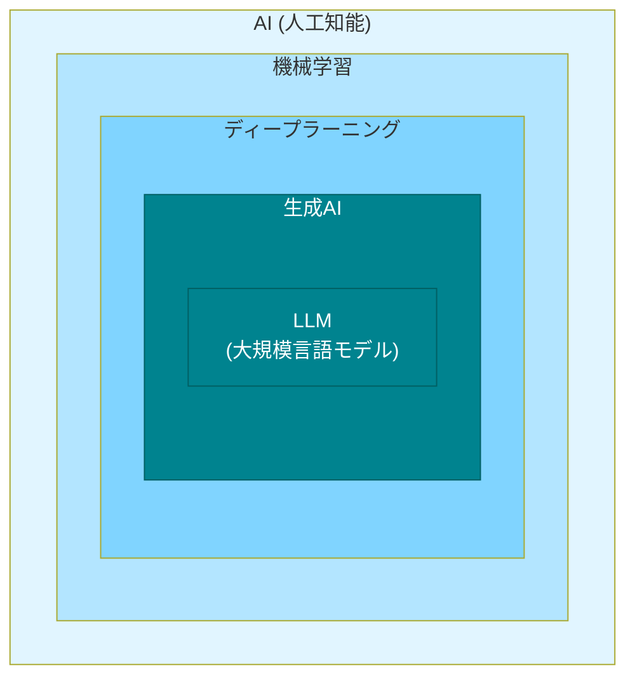

# AIの種類

AI駆動開発でよく耳にする「機械学習」「ディープラーニング」「生成AI」「LLM」といった用語について、それぞれの違いと関係性を説明します

## AI技術の全体像

まず、これらの技術がどのような関係にあるのかを見ていきます。

この図が示すように、各技術は階層構造になっています。つまり、外側の技術が内側の技術を含む関係です。

- **AI**が最も大きな概念
- その中に**機械学習**がある
- 機械学習の一種として**ディープラーニング**がある
- ディープラーニングを使った技術の1つが**生成AI**
- 生成AIの中で文章を扱うものが**LLM**

それでは、それぞれの技術を詳しく見ていきます。
