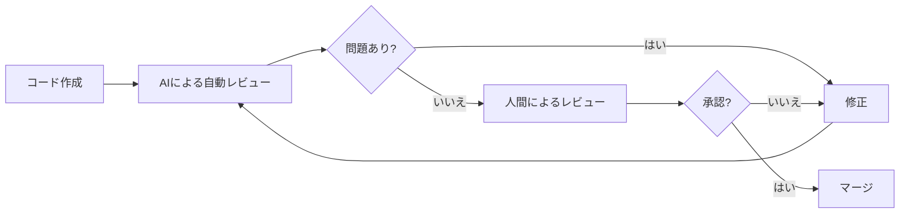
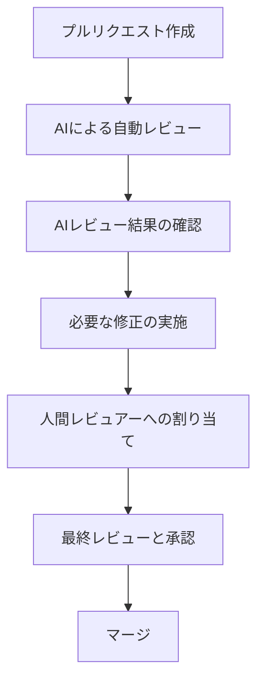
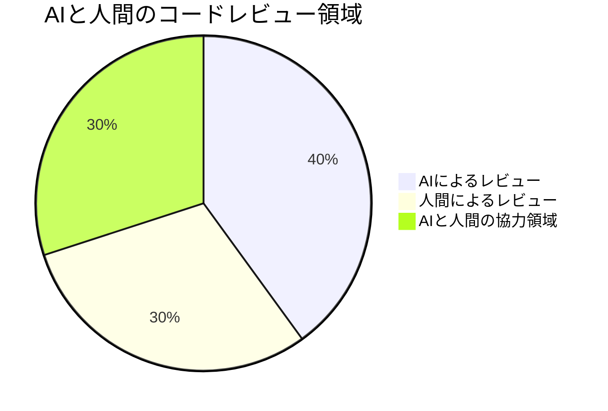

# AIを活用したコードレビュー

コードレビューは開発プロセスにおいて重要な役割を果たしますが、時間がかかり、レビュアーの負担が大きいという課題があります。AIツールを活用することで、コードレビューの効率と品質を向上させることができます。本章では、AIを活用したコードレビューの手法と実践について解説します。

## AIコードレビューのメリット

### 1. レビュー効率の向上

AIツールは数秒でコード全体をスキャンし、問題点を指摘できます。人間のレビュアーが見落としがちな細かい問題も検出します。

### 2. 一貫性の確保

AIは疲れることなく、常に同じ基準でコードをレビューします。時間帯や気分による判断のブレがありません。

### 3. 知識の補完

レビュアーが専門外の言語やフレームワークのコードをレビューする場合でも、AIはその領域の知識を補完できます。

### 4. 早期のフィードバック

開発者はコードをコミットする前に AIレビューを受けることで、問題を早期に発見・修正できます。



## AIコードレビューの種類と特徴

### 1. 静的解析型 AI

コードの実行なしに、構文やパターンの分析によって問題を検出します。

**特徴:**

- 高速な処理
- セキュリティ脆弱性の検出
- コーディング規約違反の指摘
- 潜在的なバグの予測

**例:** SonarQube + AI、DeepCode、Amazon CodeGuru

### 2. 自然言語処理型 AI

コードとコメント、コミットメッセージなどを自然言語として理解し、より高度な分析を行います。

**特徴:**

- コードの意図理解
- ドキュメントとコードの整合性チェック
- より文脈に沿った提案

**例:** GitHub Copilot、OpenAICodereviewer

### 3. 学習型 AIレビュー

チームの過去のコードやレビュー履歴から学習し、プロジェクト固有の基準でレビューを行います。

**特徴:**

- チーム固有のコーディングスタイルに適応
- 過去の問題パターンに基づく予測
- プロジェクト特有の問題検出

**例:** Pull Panda、DeepCode Brain

## AIコードレビューの導入手順

### 1. 目的とスコープの明確化

AIコードレビューの導入目的を明確にします。

- バグの早期発見が目的か
- コードの品質向上が目的か
- セキュリティ強化が目的か
- 開発者の教育が目的か

### 2. ツールの選定

プロジェクトのニーズに合った AIコードレビューツールを選定します。

- 使用言語やフレームワークのサポート
- CI/CD パイプラインとの統合のしやすさ
- コスト（無料・有料）
- カスタマイズ性

### 3. ルールとワークフローの設定

AIコードレビューのルールとワークフローを設定します。



### 4. チームへの教育と導入

チームメンバーに AIコードレビューの使い方を教育し、段階的に導入します。

- AIの指摘の意味を理解する
- 誤検出（false positive）への対応方法
- AIと人間のレビューの使い分け

### 5. 継続的な改善

AIコードレビューの効果を測定し、継続的に改善します。

- 検出された問題の統計分析
- 誤検出率の測定と調整
- 新しいルールの追加

## AIコードレビューの実践例

### セキュリティ脆弱性のレビュー

```python
# AIが検出する脆弱なコード例
def authenticate(username, password):
    query = "SELECT * FROM users WHERE username='{}' AND password='{}'".format(username, password)
    # SQLインジェクションの脆弱性あり

# AIの提案する改善例
def authenticate_safe(username, password):
    query = "SELECT * FROM users WHERE username=%s AND password=%s"
    cursor.execute(query, (username, password))
    # パラメータ化クエリでSQLインジェクション対策
```

### パフォーマンス問題の検出

```javascript
// AIが検出する非効率なコード
function findUser(users, id) {
  for (let i = 0; i < users.length; i++) {
    if (users[i].id === id) return users[i];
  }
  return null;
}

// AIの提案する改善例
function findUserOptimized(users, id) {
  return users.find((user) => user.id === id) || null;
  // Array.findメソッドを使用した効率的な実装
}
```

### コードの可読性向上

```java
// AIが検出する読みにくいコード
public List<Integer> p(List<Integer> l, int t) {
  List<Integer> r = new ArrayList<>();
  for (int i = 0; i < l.size(); i++) {
    if (l.get(i) > t) r.add(l.get(i));
  }
  return r;
}

// AIの提案する改善例
public List<Integer> filterValuesGreaterThan(List<Integer> values, int threshold) {
  List<Integer> results = new ArrayList<>();
  for (int value : values) {
    if (value > threshold) {
      results.add(value);
    }
  }
  return results;
}
// 適切な命名と構造化で可読性向上
```

## 人間と AIの適切な役割分担

AIコードレビューは人間のレビュアーに取って代わるものではなく、補完するものです。

### AIが得意な領域

- 形式的なエラーの検出
- コーディング規約違反の検出
- セキュリティ脆弱性のスキャン
- 単純な論理エラーの発見
- タイプミスや構文エラーの指摘

### 人間レビュアーが担うべき領域

- アーキテクチャの妥当性評価
- ビジネスロジックの正確性確認
- コードの全体的な設計レビュー
- 技術的負債の分析
- チーム内知識共有と教育



## AIコードレビューの課題と解決策

### 1. 誤検出（False Positive）

AIは文脈を完全に理解できないため、問題ではない箇所を問題と判断することがあります。

**解決策:**

- AIツールのカスタマイズと調整
- 誤検出のフィードバックメカニズムの確立
- 重要度のフィルタリング

### 2. 見逃し（False Negative）

AIは新しい種類の問題や複雑な文脈依存の問題を見逃すことがあります。

**解決策:**

- 人間のレビューとの組み合わせ
- AIツールの定期的な更新
- 複数の AIツールの併用

### 3. チームの抵抗感

AIレビューに対するチームの抵抗感があることもあります。

**解決策:**

- 段階的な導入
- 成功事例の共有
- AIの役割と限界の明確化
- チームへの適切な教育

## まとめ

AIを活用したコードレビューは、開発プロセスの効率化と品質向上に大きく貢献します。AIの強みと人間の強みを適切に組み合わせることで、より効果的なレビュープロセスを実現できます。

AIコードレビューツールは急速に進化していますが、最終的な判断は人間の開発者が行うべきです。AIはあくまで強力な支援ツールであり、人間の経験や判断を完全に代替するものではありません。両者の特性を理解し、相互補完的に活用することで、より高品質なソフトウェア開発が可能になります。
