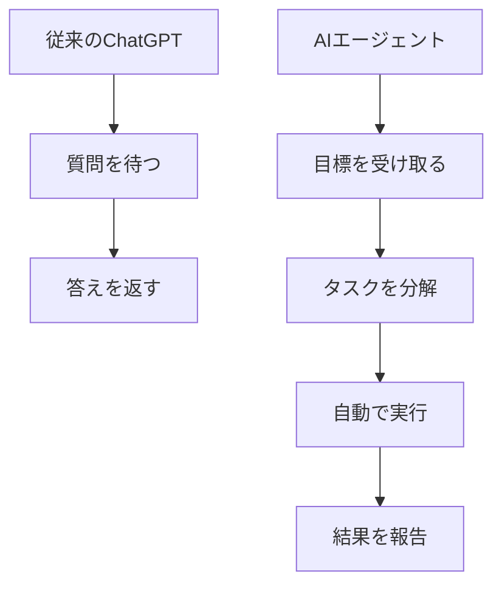
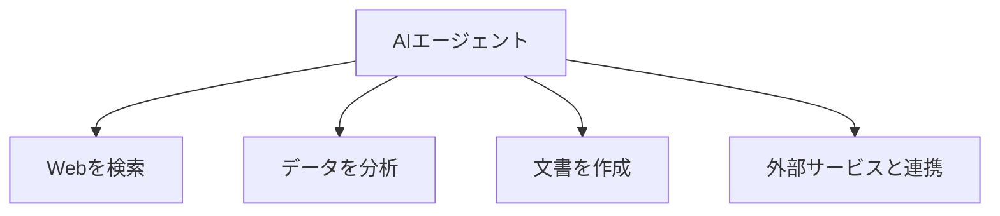

# AIエージェントとは

これまで、LLMやプロンプトといったAIの基本知識について学んできました。ChatGPTを使ったことがある方なら、「質問を投げるとAIが答えてくれる」という体験をしたことがあるでしょう。

しかし、AIの世界には、単に質問に答えるだけではない、もっと自律的に動くAIが登場しています。それが「AIエージェント」です。

## ChatGPTとAIエージェントの違い

まず、従来のChatGPTのような対話型AIと、AIエージェントの違いを見てみます。

### 従来のChatGPT（対話型AI）

従来のChatGPTは、こんな使い方をします。

```
あなた：「京都旅行のおすすめスポットを教えて」
ChatGPT：「京都には清水寺や金閣寺など、素晴らしい観光地があります...」
```

これは「一問一答型」のコミュニケーションです。あなたが質問するたびに、AIが答えを返してくれます。とても便利ですが、**あなたが質問しなければ、AIは何もしません**。

### AIエージェント

一方、AIエージェントはこんな動きをします。

```
あなた：「3泊4日の京都旅行プランを作って」
AIエージェント：
  1. 京都の観光スポットを調査
  2. 季節や天候を確認
  3. 移動時間を計算
  4. ホテルの候補をリストアップ
  5. 予算に合わせて調整
  6. 詳細な旅行プランを作成
  7. 地図付きの資料を作成
  8. 完成した旅行プランを報告
```

つまり、**あなたは最初に「何をしてほしいか」だけ伝えれば、あとはAIが自律的に作業を進めてくれます**。



## AIエージェントの基本的な能力

AIエージェントは、次のような能力を持っています。

### 1. 自律的な行動

あなたが指示した目標に向かって、AIエージェント自身が「次に何をすべきか」を考えて実行します。


### 2. ツールの使用

AIエージェントは、様々なツールを使って作業を進めます。

- **情報検索**：Web検索で最新情報を取得
- **データ処理**：ファイルの読み書き、集計、分析
- **外部サービス連携**：カレンダーへの予定追加、メール送信
- **文書作成**：レポート、プレゼン資料の作成

従来のChatGPTは「提案」しかできませんでしたが、AIエージェントは実際に「実行」します。



### 3. 問題解決能力

作業中に問題が発生しても、AIエージェントは自分で対処します。

たとえば、データ分析中に形式が異なるファイルに遭遇した場合：

1. ファイル形式を確認する
2. 適切な変換方法を考える
3. データを変換する
4. 分析を続行する
5. 結果が正しいか確認する

あなたは途中で介入する必要がありません。


## AIエージェントと従来のAIの比較

ここまでの内容を表で整理します。

| 項目 | 従来のChatGPT | AIエージェント |
|------|--------------|--------------|
| 動き方 | あなたが質問するたびに答える | 目標を受け取ったら自律的に作業 |
| 主な役割 | アドバイザー、提案者 | 実行者、作業者 |
| ツール使用 | できない | できる（検索、データ処理、文書作成など） |
| 問題対処 | 提案のみ | 自分で対処を試みる |
| 向いている作業 | 質問への回答、アイデア出し | 調査、分析、レポート作成、計画立案 |


## AI駆動開発におけるAIエージェント

これまで、AIエージェントが様々な分野で活用できることを見てきました。

プログラミングの分野では、AIエージェントは「コーディングAIエージェント」として、開発者の強力なパートナーになります。

### コーディングAIエージェントの特徴

プログラミング分野に特化したAIエージェントは、次のような能力を持っています。

#### 1. コードの作成と編集

ファイルを作成し、実際にコードを書きます。提案だけでなく、実際のファイル操作を行います。

#### 2. コマンドの実行

ターミナルコマンドを実行できます。テストの実行、ライブラリのインストール、ビルドの実行などが可能です。

#### 3. エラーの自動修正

コードを実行してエラーが出た場合、自分でエラーメッセージを読み取り、修正を試みます。

#### 4. プロジェクト全体の把握

単一のファイルだけでなく、プロジェクト全体の構造を理解して作業します。

### プログラミング分野での活用例

#### 例1：新しいプロジェクトの立ち上げ

**あなたの指示：**
「Node.jsでTodoアプリを作成して、テストも書いて」

**AIエージェントの動き：**

1. プロジェクトフォルダを作成
2. package.jsonを作成
3. 必要なライブラリをインストール
4. サーバーコードを作成
5. フロントエンドのHTMLを作成
6. テストコードを作成
7. テストを実行して動作確認
8. 「完了しました」と報告

#### 例2：バグ調査と修正

**あなたの指示：**
「ユーザー登録機能でエラーが出ているので調査して修正して」

**AIエージェントの動き：**

1. エラーログを確認
2. 関連するコードファイルを探索
3. データベースのスキーマを確認
4. 問題箇所を特定（バリデーションの不足）
5. コードを修正
6. テストを実行
7. 修正内容を報告

#### 例3：ドキュメント作成

**あなたの指示：**
「このプロジェクトのREADMEを作成して」

**AIエージェントの動き：**

1. プロジェクトの構造を分析
2. package.jsonから依存関係を確認
3. コードから機能を把握
4. セットアップ手順を確認
5. README.mdを作成
6. 図解も追加
7. 完成を報告

### 代表的なコーディングAIエージェント

現在、いくつかのコーディングAIエージェントが利用可能です。

#### Claude Code

Anthropic社が提供するAIエージェントです。ファイル操作、コマンド実行、Web検索などができます。この本の後半で詳しく扱います。

#### Cursor（Agent機能）

コードエディタCursorに搭載されているAIエージェント機能です。エディタ内でファイルを作成・編集できます。

#### Devin

ソフトウェア開発に特化したAIエージェントです。複雑なプロジェクトも自律的に進められます。

## AIエージェントの登場で何が変わるのか

AIエージェントの登場により、ソフトウェア開発は大きく変わります。

### 変化1：「質問力」から「目標設定力」へ

従来のChatGPTでは、「どう質問するか」が重要でした。しかしAIエージェントでは、「何を達成したいか」を明確に伝えることが重要になります。

**従来のChatGPT：**
「Pythonでファイルを読み込む方法を教えて」
「その方法でエラーが出たんだけど」
「このエラーの対処法は？」

**AIエージェント：**
「CSVファイルを読み込んでグラフを作成して」

### 変化2：「提案」から「実行」へ

従来は、AIが提案したコードをあなたがコピーして実行していました。AIエージェントは、提案だけでなく実行まで行います。

### 変化3：「単発作業」から「プロジェクト完遂」へ

従来は、一つ一つの作業をAIに質問していました。AIエージェントは、プロジェクト全体を通して作業を進められます。

## 注意点

AIエージェントは強力ですが、注意すべき点もあります。

### 1. 完璧ではない

AIエージェントも間違えることがあります。生成したコードにバグが含まれる可能性もあります。

### 2. 最終確認は人間が行う

AIエージェントが作成したコードやファイルは、必ず人間が確認します。特にセキュリティに関わる部分は注意が必要です。

### 3. 目標の明確化が重要

曖昧な指示だと、AIエージェントは意図しない動きをします。「何を達成したいか」を明確に伝えることが重要です。

## まとめ

この章では、AIエージェントについて学びました。

- **従来のChatGPT**は「質問に答えてくれる賢いAI」
- **AIエージェント**は「自律してタスクをこなしてくれるAI」
- AIエージェントは旅行計画、技術調査など様々な分野で活用できる
- プログラミング分野では「コーディングAIエージェント」として活躍する
- ツールを使って実際に作業を実行できる
- エラーが発生しても、自分で対処しながら目標を達成する
- 開発の流れが「質問と回答」から「目標設定と実行」に変わる

