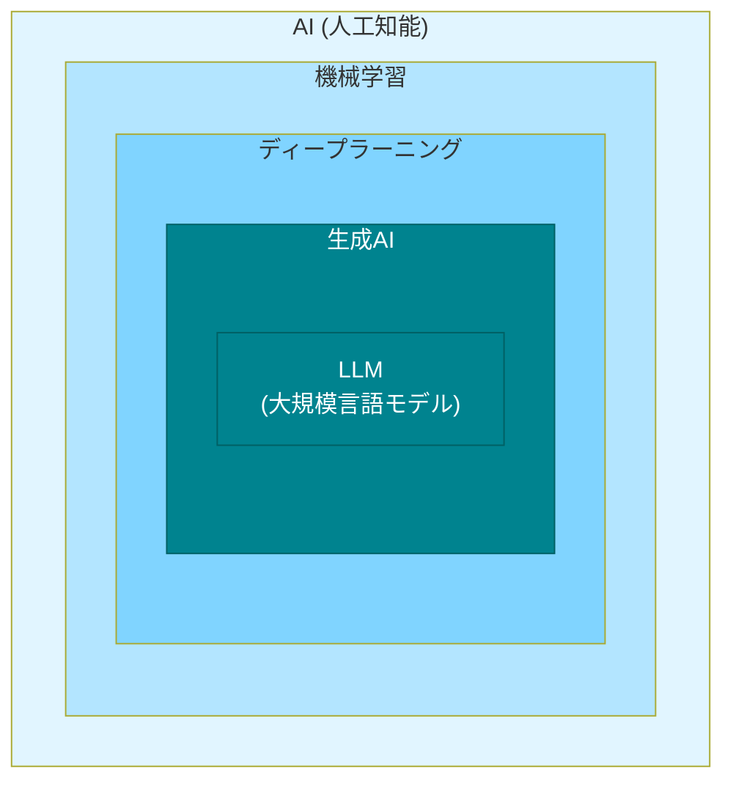

# まとめ

これまで、AI技術の種類とそれぞれの違いについて学びました。

## AI技術の種類と違い

**AI**という大きな概念の中に、**機械学習**があります。機械学習の一種として**ディープラーニング**があり、ディープラーニングを使った技術の1つが**生成AI**です。そして生成AIの中でテキストに特化したものが**LLM**です。

外側の技術が内側の技術を含む、入れ子構造になっています。

## 各技術の役割

### 機械学習
- データからパターンを学習する基本技術
- スパム判定、需要予測、異常検知などに使われる

### ディープラーニング
- 人間の脳を真似た多層構造で学習
- 画像認識、音声認識、翻訳などが得意
- 特徴を人間が定義する必要がなく、AIが自動で見つける

### 生成AI
- 新しいコンテンツを生成する技術
- 従来のAI（分類・判定）と違い、文章、画像、音声などを生み出せる
- テキスト生成AI、画像生成AI、音声生成AIなどがある

### LLM（大規模言語モデル）
- 生成AIの中でテキストに特化したもの
- ChatGPT、Claude、Geminiなどがこれにあたる
- 文章の理解、生成、コード生成ができる

## 「技術」と「モデル」の違い

機械学習、ディープラーニング、LLMなどの各技術は、AIの学習方法です。

一方、**モデル**は学習した結果完成したAIです（GPT-4、Claude 3.5 Sonnetなど）。

ChatGPTは、OpenAI社が提供している**AIサービス名**で、その中で動いているGPT-4が**モデル**です。モデルによって性能、速度、コストが違います。

タスクに応じて適切なモデルを選ぶことで、品質とコストのバランスを取れます。
