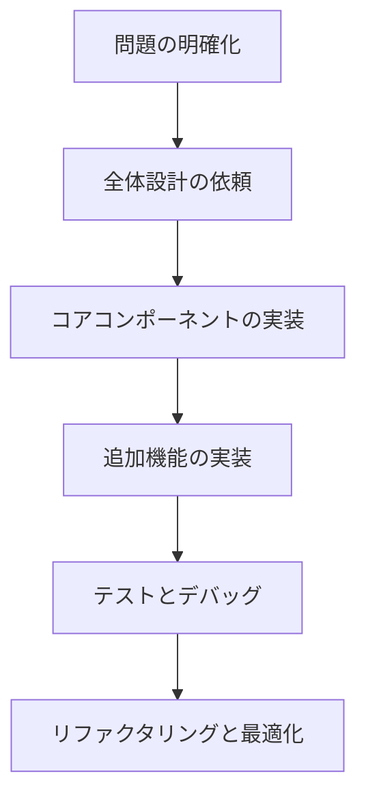
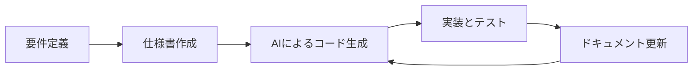
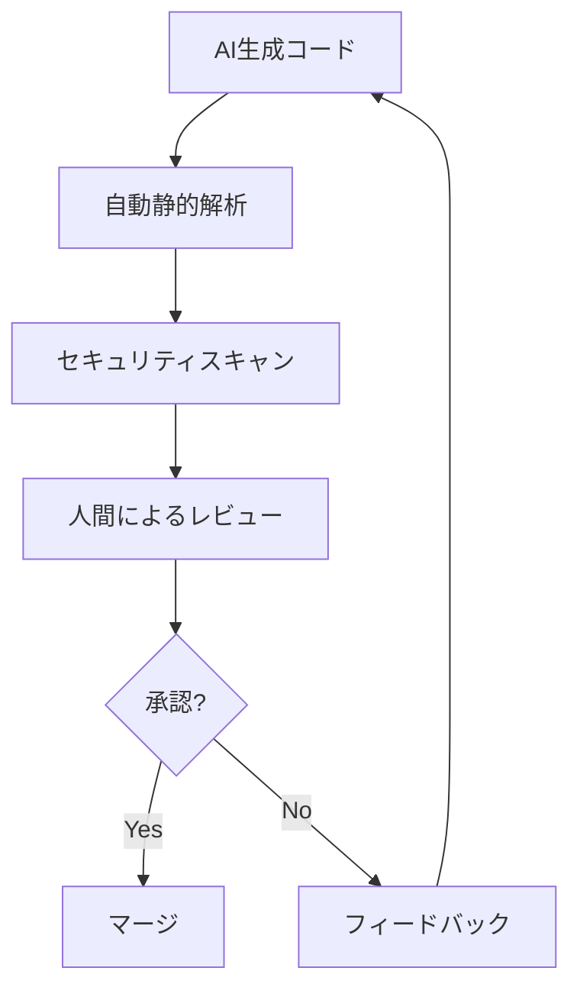

# AI駆動開発のベストプラクティス

AI駆動開発を効果的に行うためには、単に AIツールを使うだけでなく、適切な方法論と実践が必要です。本章では、AI駆動開発において高い成果を上げるためのベストプラクティスを紹介します。

## プロンプトエンジニアリングの基本

### 明確で具体的な指示

AIに指示を出す際は、具体的かつ明確な表現を心がけましょう。

**悪い例：**

```
アプリを作って
```

**良い例：**

```
Reactを使用して、ユーザーが項目を追加・編集・削除できるTodoリストアプリを作成してください。
各Todoアイテムには、タイトル、説明、期限、優先度（高・中・低）の情報を含めてください。
```

### コンテキストの提供

AIに十分な背景情報を提供することで、より適切な回答を得られます。

**悪い例：**

```
このコードを最適化して
```

**良い例：**

```
以下のJavaScriptコードはユーザーデータを取得するための関数ですが、現在パフォーマンスの問題があります。
特に大量のデータを処理する際に遅延が発生しています。
メモリ使用量を抑えつつ、処理速度を向上させるように最適化してください。
```

### 段階的な指示

複雑なタスクは段階に分けて指示すると、より質の高い結果が得られます。



## AIとの効果的な共同作業

### コード生成と修正のサイクル

AIが生成したコードを盲目的に受け入れるのではなく、レビュー・修正・再生成のサイクルを確立しましょう。

1. コード生成：AIに初期コードを生成させる
2. レビュー：生成されたコードを細部まで確認する
3. フィードバック：問題点や改善点を明確に伝える
4. 再生成：フィードバックを基にコードを再生成させる
5. 統合：最終的に満足できるコードを自分のプロジェクトに統合する

### エラー解決のアプローチ

AIを活用したエラー解決を効率的に行うためのアプローチです。

1. エラーメッセージの全文とスタックトレースを提供する
2. エラーが発生した環境（OS、ライブラリのバージョンなど）を伝える
3. 問題の再現手順を詳細に説明する
4. すでに試した解決策があれば伝える
5. AIからの解決策を試した結果をフィードバックする

### ドキュメント駆動開発との組み合わせ

AI駆動開発では、ドキュメント駆動開発（DDD）との組み合わせが効果的です。



1. まず詳細な仕様書や API 設計書を作成する
2. それを AIに提供して実装を依頼する
3. 生成されたコードを実装し、テストする
4. 実装に基づいてドキュメントを更新する
5. 更新したドキュメントを基に次の機能を AIに依頼する

## AIに適した開発タスク

### 向いているタスク

AIツールが特に効果を発揮する開発タスクを把握しましょう。

- **ソースコードの生成**

  - クラス定義、インターフェース実装
  - CRUD オペレーションの実装
  - 設定ファイルの作成

- **ユニットテストの作成**

  - テストケースの自動生成
  - エッジケースの考慮
  - モックオブジェクトの作成

- **既存コードの変換**

  - 言語間の変換（JavaScript から TypeScript へなど）
  - フレームワーク間の移行（React→Vue など）
  - API の形式変換（REST から GraphQL へなど）

- **ドキュメント生成**
  - コードからの API 仕様書生成
  - ユーザーマニュアルの作成
  - コードの解説コメント追加

### 向いていないタスク

AIツールの限界を理解し、人間が主導すべきタスクを識別しましょう。

- **セキュリティクリティカルな実装**

  - 認証・認可システム
  - 暗号化ロジック
  - セキュリティ監査

- **高度なアルゴリズム設計**

  - パフォーマンスクリティカルな処理
  - 分散システムの調整
  - 機械学習モデルの設計

- **ドメイン特化の複雑なビジネスロジック**
  - 業界特有の規制対応
  - 複雑な計算ロジック
  - レガシーシステムとの統合

## AIコードの品質確保

### 自動テストの強化

AI生成コードは、より徹底したテストが必要です。

- ユニットテストのカバレッジを高める（80%以上を目標）
- 統合テストで実際の環境での動作を確認
- プロパティベーステスト（Property-based testing）の導入
- カオスエンジニアリング手法の適用

### コードレビューの強化

AI生成コードに対する効果的なレビュープロセスを確立しましょう。



1. 静的解析ツールによる自動チェック
2. セキュリティ脆弱性スキャン
3. パフォーマンス分析
4. 人間による詳細レビュー
   - ビジネスロジックの正確性
   - エッジケースの考慮
   - コードの可読性と保守性

### 継続的学習と改善

AIとの協業スキルを継続的に向上させましょう。

- AIの限界と強みを理解する
- 効果的なプロンプトパターンを収集する
- プロジェクト固有のプロンプトライブラリを構築する
- チーム内でのベストプラクティス共有を定期的に行う

## プロジェクト管理との統合

### アジャイル開発と AI駆動開発

アジャイル開発手法と AI駆動開発を組み合わせる方法です。

- スプリント計画時に AIで実装可能なタスクを特定
- 複雑性の高いタスクは人間が、定型的なタスクは AIが担当
- デイリースクラムで AI活用の成果と課題を共有
- スプリントレトロスペクティブで AI活用の改善点を議論

### チーム全体での AIスキル向上

チーム全体で AI活用スキルを向上させるための施策です。

- AIプロンプトエンジニアリングのトレーニングセッション
- 成功した AIプロンプトとその成果の共有
- ペアプログラミングでの AI活用実践
- AIツールの最新アップデートと機能の共有

## 実践的な AI活用シナリオ

### 新規プロジェクトの立ち上げ

新規プロジェクトを AIを活用して効率的に立ち上げる手順です。

1. プロジェクトの要件とアーキテクチャを AIと議論
2. プロジェクトの基本構造と設定ファイルの生成
3. 主要コンポーネントの雛形実装
4. CI/CD 設定の自動生成
5. 初期ドキュメントの作成

### レガシーコードのモダナイゼーション

レガシーコードを AIを活用して効率的に刷新する方法です。

1. レガシーコードの分析と理解を AIに依頼
2. 現代的な技術スタックへの移行計画策定
3. コア機能の段階的な変換
4. テストスイートの強化
5. 新旧システムの並行運用とフェーズアウト

### マイクロサービスへの分割

モノリシックなアプリケーションをマイクロサービスに分割する際の AI活用方法です。

1. 既存システムの依存関係分析
2. 境界づけられたコンテキスト（Bounded Context）の特定
3. サービス分割の設計
4. 各マイクロサービスの実装
5. サービス間通信とオーケストレーションの実装

## 持続可能な AI駆動開発

### 倫理的な配慮

AI駆動開発における倫理的な配慮事項です。

- 著作権と知的財産権の尊重
- AIが生成したコードの出典と責任の明確化
- ユーザーデータのプライバシー保護
- AIの判断バイアスへの対処

### コスト管理

AI駆動開発のコストを適切に管理する方法です。

- AIサービスの使用量モニタリング
- コスト効率の高いプロンプト設計
- 無料・有料サービスの適切な使い分け
- ROI の定期的な評価

### スキル開発の継続

開発者としてのスキルを衰えさせないための施策です。

- AIに依存しすぎない領域の設定
- 基本的なプログラミングスキルの継続的な訓練
- 最新技術トレンドへの意識的な学習
- ペアプログラミングやコードレビューの習慣化

## まとめ

AI駆動開発は強力なツールですが、最大限の効果を得るためには適切な方法論と実践が必要です。明確なプロンプト、効果的な共同作業プロセス、品質確保の仕組み、そして継続的な学習を通じて、AIを開発プロセスに統合することで、生産性と品質の両面で大きな向上が期待できます。

ただし、AI駆動開発はあくまで開発者を支援するためのものであり、開発者の創造性や判断力を置き換えるものではありません。AIの限界を理解し、人間の強みと AIの強みを組み合わせることで、最も効果的な開発プロセスを実現することができます。

AIツールは日々進化しているため、継続的に学び、適応していくことが重要です。チーム全体でのベストプラクティスの共有と改善を通じて、AI駆動開発の可能性を最大限に引き出していきましょう。
