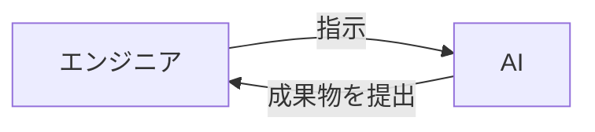

# もうエンジニアは不要？AI駆動開発とは？

近年、AIの目覚ましい進化により、ソフトウェア開発の現場に大きな変革が訪れようとしています。もしかすると、「エンジニアの仕事はAIに奪われるのではないか？」と不安を感じている方もいるかもしれません。結論から申し上げると、コードを書くというエンジニアの仕事は、間違いなくAIに置き換えられていきます。これは遠い未来の話ではなく、すでに多くの開発現場で、AIが人間の業務を代替し始めています。今後2～3年でさらに加速していきます。

では、エンジニアはもう必要なくなるのでしょうか？

残念ながら、今後は「AIに仕事を奪われるエンジニア」と「生き残るエンジニア」の**二極化**が進みます。

## 仕事を失うエンジニアとは？

AIを使いこなせないエンジニアの多くは、職を失うか、年収が下がります。特に、日々の業務でコーディングやテストといった作業が中心のエンジニアは、AIに仕事を奪われます。

-----

## AIと共存し、生き残るエンジニアの未来

一方で、AIを使いこなし、上流工程のスキルを持つ一部のエンジニアは、これまで以上に市場価値が高まるでしょう。今後は、コーディングやテストといった具体的な実装作業はAIが行うようになります。その結果、人間のエンジニアに求められる役割は、以下のようなものに変化していきます。

  * **要件定義:** 顧客とリアルに会話し、要件をまとめる。
  * **AIへの指示・依頼:** 要件をAIに伝え、実装を依頼する
  * **レビューと検証:** AIが生成した成果物を検証する。

このように、生き残るエンジニアになるためには、**上流工程のスキル**と**AIを使いこなすスキル**の2つが必須となります。

## エンジニアの役割はどう変わるのか

AI駆動開発では、エンジニアは「作業者」から「AIへの指示を出す人」へと役割が変わります。
つまりAIという部下を持つマネージャーへ昇格するのです。

**エンジニアの役割**
- 指示を出す
- AIの成果物をチェックする

**AIの役割**
- コードの作成
- テストコードの作成
- ドキュメントの作成
など

## AI駆動開発とは？

ここまでお話した「AIを使いこなすスキル」こそが、本書のテーマである「AI駆動開発」です。

AI駆動開発とは、「AIを駆使して、システム開発の各プロセスを効率化する開発手法」のことです。従来の開発では、エンジニアがすべてのコードを手作業で書いていましたが、AI駆動開発では、コーディングをAIで自動化します。もうエンジニアがコードを書く時代は終わったのです。

エンジニアが要件や仕様を整理し、AIに適切な指示を出すことで、コードの生成、テストコードの作成、バグの修正といった作業を自動化します。

今後、エンジニアの仕事は「実装者」ではなく「AIという部下を持ったマネージャー」の役割へとシフトします。
でも心配ありません。本書では、これらのスキルを体系的に学んでいきます。

## 変化を恐れず、時代の波に乗ろう

AIによる開発の波は、もはや避けることのできない現実です。

しかし、これはピンチでもあり、チャンスでもあります。

AIに仕事を奪われると恐れるのではなく、**AIを強力なパートナーとして活用する**視点を持つことが重要です。AIを使いこなすことで、あなたは超人的な生産性を手に入れた「スーパーエンジニア」になることが出来るのです。

本講座では、そんな未来を実現するための知識とスキルを、基礎からわかりやすく解説していきます。一緒にこれからの時代を生き残りましょう！

