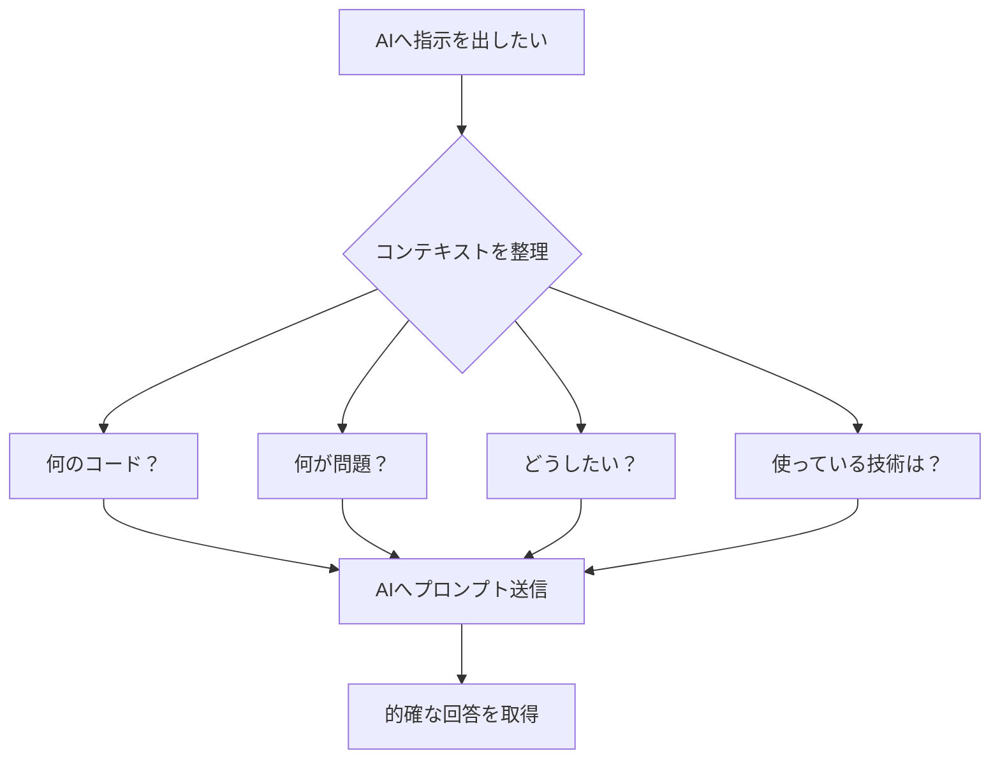

# コンテキストとは

## こんな経験はありませんか？

友達から突然「あれ、どうだった？」と聞かれたら、あなたは「え？何のこと？」と困惑しますよね。

しかし、「昨日話してたラーメン屋、美味しかった？」と聞かれたら、「あぁ・・それね！」と、すぐに返答できます。

この違いは何でしょうか？それが「コンテキスト」です。

## コンテキストとは何か

コンテキストとは、「文脈」や「背景情報」を意味します。

会話において、相手が何について話しているのかを理解するために必要な情報のことです。

先ほどの例でいえば、「昨日話してた新しいラーメン屋」という部分がコンテキストです。この情報があるから、「何についての会話なのか？」が分かるのです。

### 日常会話でのコンテキストの例

もう少し具体的な例を見てみましょう。

**例1：買い物の話**

```
コンテキストなし：
「どっちがいいと思う？」

コンテキストあり：
「今度のデート、映画とカフェどっちがいいと思う？」
```

「どっちがいいと思う？」だけだと、服の色のことなのか、ランチのメニューのことなのか、全く分かりません。でも、「今度のデート、映画とカフェ」という背景情報があれば、何について聞かれているのかが明確になります。

**例2：仕事の依頼**

```
コンテキストなし：
「明日までにお願いできる？」

コンテキストあり：
「さっき話した資料の作成、明日までにお願いできる？」
```

「明日までに」と言われても、何をすればいいのか分かりません。「さっき話した資料の作成」という情報があって初めて、何をすべきかが理解できます。

## なぜコンテキストが重要なのか

人間同士の会話では、私たちは無意識にコンテキストを使っています。

「それ」「あれ」「この前の」といった言葉を使うとき、お互いに共通の背景情報を持っているという前提があります。

でも、その前提が共有されていないと、会話が成り立ちません。


## AIにおけるコンテキストの重要性

実は、AIとの会話でも、コンテキストは非常に重要になります。

むしろ、AIは人間のように「察する」ことができないので、人間同士の会話以上にコンテキストが大切になると言えます。

### AIはコンテキストなしでは理解できない

AIは、あなたと過去にどんな会話をしたか、今何について話そうとしているのかを、明示的に伝えられないと理解できません。

例えば、ソフトウェア開発の場面でこんなプロンプトを送ったとします。

**コンテキストなしのプロンプト：**

```
このコードを修正してください。
```

AIはこう思うでしょう。「どのコードのこと？何を修正すればいいの？」

これでは、AIは何をすればいいのか分かりません。

**コンテキストありのプロンプト：**

```
以下はログイン機能のコードです。

パスワードのセキュリティが甘いので、最小文字数が8文字になるように修正してください。

# コード
（コードを貼り付け）
```

このように、何についての話なのか（ログイン機能のコード）、何が問題なのか（パスワードのセキュリティが甘い）、どう修正してほしいのか（パスワード要件の強化）を明確に伝えることで、AIは適切に対応できるようになります。


## コンテキストを意識すると開発効率が上がる



AIに質問する前に、以下のコンテキストを整理する習慣をつけましょう。

1. **何について聞きたいのか**（対象の明確化）
2. **今どういう状況なのか**（現状の説明）
3. **何をしてほしいのか**（目的の明示）
4. **どんな環境・技術を使っているのか**（技術スタックの共有）

これらの情報を含めることで、AIとのコミュニケーションが格段にスムーズになります。

## コンテキストは会話の基本

人間同士の会話でも、AIとの会話でも、コンテキストは欠かせません。

「それ」「あれ」で通じるのは、お互いに同じ背景情報を持っているからです。

AIは私たちの頭の中を読めないので、必要な情報を明示的に伝える必要があります。

最初は面倒に感じるかもしれませんが、コンテキストを丁寧に伝える習慣をつけることで、AIからより的確で有用な回答が得られるようになります。

これは、AI駆動開発において最も基本的で、最も重要なスキルの一つです。

次のセクションでは、AIがコンテキストをどのように処理しているのか、「コンテキストウィンドウ」という概念について学んでいきます。
