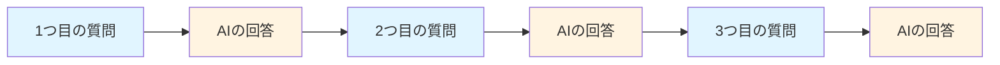
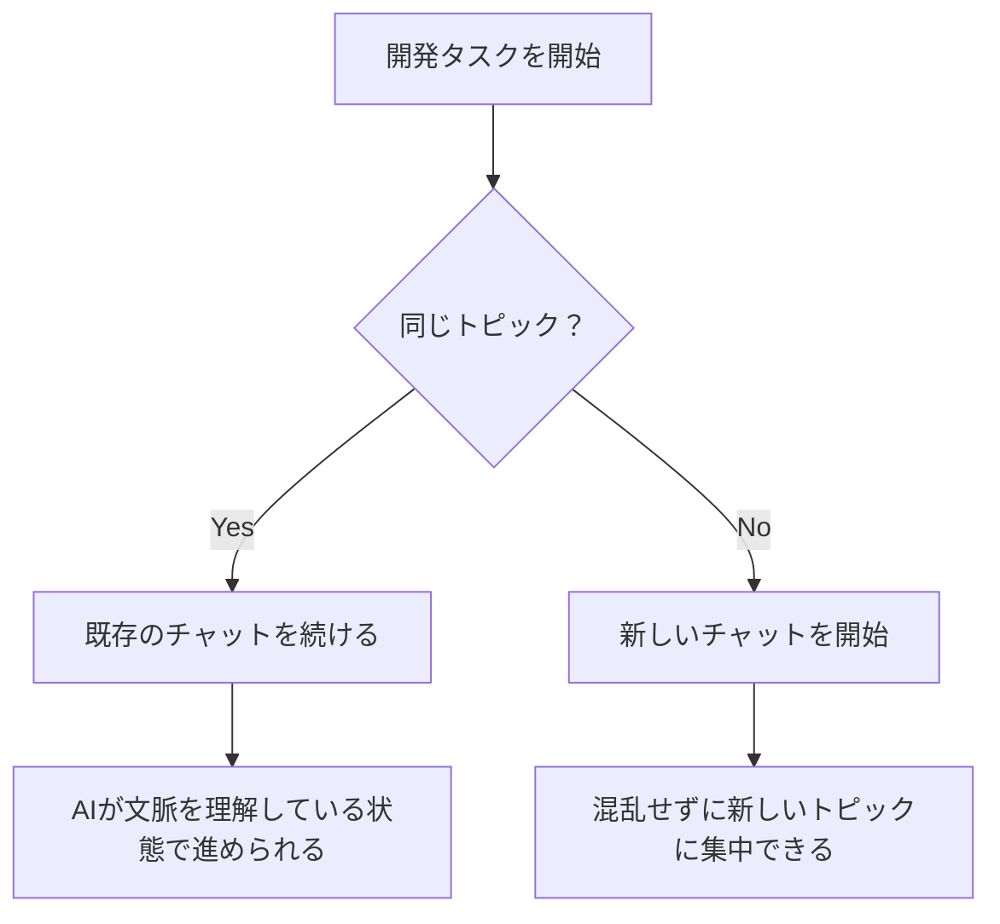

# コンテキストウィンドウとは

前のセクションで、AIとの会話においてもコンテキストが重要であることを学びました。

では、AIはどのようにコンテキストを処理しているのでしょうか？

そこで登場するのが「コンテキストウィンドウ」という概念です。

## 1つのチャット = 1つのコンテキストウィンドウ

コンテキストウィンドウとは、「AIが記憶できる会話の範囲」のことです。

もっとシンプルに言うと、**1つのチャット画面 = 1つのコンテキストウィンドウ**です。

### AIは同じチャット内の会話を覚えている

ChatGPTなどのチャットツールを使うとき、同じチャット画面の中であれば、AIは以前の会話をすべて記憶しています。

これは、人間同士の会話と同じです。

友達との会話が続いている限り、「さっき話したアレ」「それ」「あれ」で通じますよね。

AIも同じで、同じチャット内であれば、前の質問や回答を覚えているので、「それ」「その機能」「さっきのコード」といった表現でも通じます。



この一連の流れが、1つのコンテキストウィンドウです。

### 具体的な会話例で理解する

実際の開発現場での例を見てみましょう。

**1つ目の質問：**

```
Reactでログイン機能を作ってください。
```

**AIの回答：**

```javascript
// ログイン機能のコード（省略）
```

**2つ目の質問：**

```
それにバリデーションも追加してください。
```

**AIの回答：**

```javascript
// バリデーション付きログイン機能のコード（省略）
```

**3つ目の質問：**

```
パスワードは8文字以上に制限してください。
```

**AIの回答：**

```javascript
// パスワード文字数制限も追加されたコード（省略）
```

このように、2つ目の質問で「それに」、3つ目の質問で「パスワードは」と言うだけで、AIは何について話しているのかを理解します。

なぜなら、同じチャット内（同じコンテキストウィンドウ内）では、これまでの会話内容をすべて覚えているからです。

### 新しいチャットを始めると記憶はリセットされる

しかし、新しいチャットを開始すると、以前の会話は記憶されません。

これは、**別のコンテキストウィンドウになる**からです。

新しいチャットで「さっきのログイン機能に...」と言っても、AIは「何のこと？」となります。

別のコンテキストウィンドウでは、前のチャットの内容は存在しないからです。

これは、初めて会った人に「さっき話したアレなんだけど」と話しかけるようなものです。

### なぜこの仕組みが重要なのか

この「1つのチャット = 1つのコンテキストウィンドウ」という仕組みを理解することで、AIとの開発がスムーズになります。

**メリット：**

- 同じチャット内では、毎回詳細を説明し直す必要がない
- 「それ」「その機能」といった短い表現で通じる
- 段階的に機能を追加していける

**注意点：**

- 別のチャットでは、以前の会話は参照できない
- 新しいチャットで続きをする場合は、必要な情報を改めて伝える必要がある

## コンテキストウィンドウには上限がある

ここまで、同じチャット内ではAIが会話を覚えていることを説明しました。

しかし、実はコンテキストウィンドウには上限があります。

### 上限トークン数

コンテキストウィンドウは、トークン数で上限が決まっています。

主要なモデルのコンテキストウィンドウサイズは以下の通りです。

| モデル | コンテキストウィンドウ | 目安 |
|--------|------------------------|--------------|
| GPT-4 Turbo | 128,000トークン | 本の1章分程度 |
| Claude 3.5 Sonnet | 200,000トークン | 本の2章分程度 |
| Gemini 1.5 Pro | 1,000,000トークン | 本の1冊分程度 |


通常の開発タスクであれば、よほど長い会話をしない限り上限に達することはありません。

しかし、大量のコードを貼り付けたり、長時間の会話を続けたりすると、上限に達する可能性があります。

### 上限に達するとどうなるか？・・古い会話を忘れる

コンテキストウィンドウの上限に達すると、AIは古い会話から順に忘れていきます。

つまり、チャットの最初のほうでやり取りした内容が、AIの記憶から消えてしまうのです。

**例：**

1. 最初に「Reactでログイン機能を作って」と依頼
2. その後、様々な依頼でコンテキストウィンドウの上限に達すると最初の会話を忘れる
3. すると「最初の機能を修正して」と依頼しても、AIはそれを忘れているので混乱する

これは、人間が長い会話の最初のほうの内容を忘れてしまうのと似ています。

## コンテキストウィンドウを意識した効果的な使い方

コンテキストウィンドウの仕組みを理解したら、次は効果的な使い方を身につけましょう。

### 長い開発タスクは1つのチャットで続ける

関連する開発タスクは、できるだけ1つのチャットで進めましょう。

**良い例：**

```
【1つのチャットで】
1. ログイン機能の実装
2. パスワードリセット機能の追加
3. メール認証機能の追加
4. エラーハンドリングの追加
```

こうすることで、AIはこれまでの実装内容を覚えているので、「さっき作ったログイン機能に...」と言うだけで通じます。

**悪い例：**

```
【チャット1】ログイン機能の実装
【チャット2】パスワードリセット機能の追加（新しいチャット）
【チャット3】メール認証機能の追加（新しいチャット）
```

新しいチャットを開くたびに、これまでの実装内容を改めて説明しなければなりません。

### 別のトピックに移る時は新しいチャットを開始する

逆に、全く別のトピックに移る時は、新しいチャットを開始したほうが良いです。

**例：**

```
【チャット1】ユーザー認証機能の実装
【チャット2】商品検索機能の実装（新しいチャット）
【チャット3】決済機能の実装（新しいチャット）
```

なぜなら、関連性のない会話が混ざると、AIが混乱する可能性があるからです。

また、後から見返したときに、どのチャットで何を話したかがわかりやすくなります。



### コンテキストウィンドウがいっぱいになってきたら要約してもらう

長い会話を続けていて、「そろそろコンテキストウィンドウがいっぱいになりそうだな」と感じたら、要約してもらうテクニックがあります。

**要約を依頼するプロンプト例：**

```
これまでの会話内容を要約してください。
特に、実装した機能とその仕様について簡潔にまとめてください。
```

AIが要約してくれたら、その内容をコピーして、新しいチャットで共有します。

**新しいチャットでの最初のメッセージ：**

```
以下は、これまでに実装した機能の要約です。

【要約内容をペースト】

この続きから開発を進めたいです。
```

こうすることで、コンテキストウィンドウをリセットしつつ、重要な情報は引き継げます。


## まとめ

コンテキストウィンドウとは、AIが記憶できる会話の範囲のことです。

1. **1つのチャット = 1つのコンテキストウィンドウ**
   - 同じチャット内では、AIはすべての会話を記憶している
   - 「それ」「さっきの」で通じる

2. **新しいチャット = 新しいコンテキストウィンドウ**
   - 別のチャットでは、以前の会話は参照できない
   - 新しいチャットでは、必要な情報を改めて伝える

3. **コンテキストウィンドウには上限がある**
   - トークン数で上限が決まっている
   - 上限に達すると、古い会話から忘れられる

4. **効果的な使い方**
   - 関連するタスクは1つのチャットで進める
   - 別のトピックでは新しいチャットを開始
   - いっぱいになったら要約してもらう

この仕組みを理解することで、AIとのコミュニケーションが格段にスムーズになります。

「なぜAIは急に話が通じなくなったのか？」という疑問も、コンテキストウィンドウの仕組みを知っていれば解決できます。

