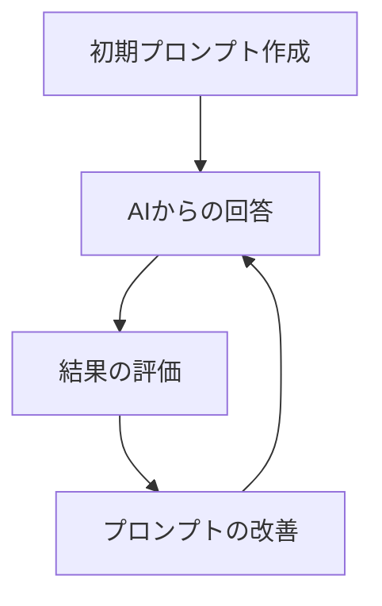

# プロンプトのチューニングと最適化

AI駆動開発において、プロンプト（AIへの指示）の質は出力結果の質に直結します。この記事では、より効果的な開発を実現するためのプロンプトのチューニングと最適化手法について解説します。

## プロンプト最適化の基本原則

### 1. 明確さと具体性

AIに曖昧な指示を与えると、曖昧な結果が返ってきます。指示は可能な限り明確かつ具体的であるべきです。

**改善前**：

```
ログイン機能を作って
```

**改善後**：

```
React 18とTypeScriptを使用したログイン機能のコンポーネントを実装してください。
必要な機能:
1. メールアドレスとパスワードの入力フォーム
2. 入力バリデーション（メールフォーマット、パスワード強度）
3. ログイン状態の保持（React Context API使用）
4. エラーメッセージの表示
5. ローディング状態の表示

スタイリングはTailwind CSSを使用し、レスポンシブデザインに対応させてください。
```

### 2. コンテキストの提供

AIはあなたのプロジェクトを知りません。関連する背景情報を提供することで、より適切な回答を得られます。

**改善前**：

```
このバグを修正して
```

**改善後**：

```
以下のReactコンポーネントにバグがあります。ユーザーリストを表示する際に「Cannot read properties of undefined (reading 'map')」というエラーが発生しています。

問題のコンポーネント:
[コード]

このコンポーネントはユーザーデータを取得し、一覧表示するものです。APIからデータを取得する前に表示しようとしていることが原因と思われます。適切なローディング処理と条件付きレンダリングを実装して修正してください。
```

### 3. 出力形式の指定

AIにどのような形式で回答して欲しいかを明示することで、より使いやすい結果を得られます。

```
回答は以下の形式で提供してください:
1. 問題の分析
2. 解決策の説明
3. 修正後のコード全体
4. テスト方法の提案
```

## プロンプトのチューニング手法

### 1. 反復的なフィードバックループ

プロンプトは一度で完璧にする必要はありません。以下のサイクルを繰り返すことで最適化できます。



**実践例**：

1. 初期プロンプトを送信
2. AIの回答を確認し、足りない点や問題点を特定
3. フィードバックを含めて追加質問や指示を出す
4. より良い回答が得られるまで繰り返す

### 2. ロールプレイの活用

AIに特定の役割を与えることで、その専門性に基づいた回答を得られます。

**改善前**：

```
このコードのセキュリティ問題を指摘して
```

**改善後**：

```
あなたはセキュリティの専門家です。以下のNode.js/Expressコードを分析し、OWASP Top 10に関連するセキュリティ脆弱性を特定してください。各脆弱性について、その重大度、潜在的なリスク、修正方法を詳細に説明してください。
```

### 3. 例示の活用（Few-shot learning）

AIに期待する出力形式や質を具体例として示すことで、より適切な回答を引き出せます。

**改善前**：

```
JavaScriptでデータ検証関数を作成して
```

**改善後**：

````
JavaScriptでフォームデータを検証する関数を作成してください。以下は名前検証の例です:

```javascript
/**
 * ユーザー名が有効かどうかを検証する
 * @param {string} name - 検証する名前
 * @returns {boolean} 名前が有効な場合はtrue、そうでない場合はfalse
 */
function validateName(name) {
  if (!name || typeof name !== 'string') return false;
  if (name.trim().length < 2 || name.trim().length > 50) return false;
  if (!/^[a-zA-Z\s]+$/.test(name)) return false;
  return true;
}
````

同じスタイルで、以下の検証関数を実装してください:

1. メールアドレス検証関数
2. パスワード強度検証関数（弱/中/強を返す）
3. 電話番号検証関数（国際形式）

```

### 4. チェーン・オブ・ソート（Chain-of-Thought）

複雑な問題は、段階的に思考プロセスを展開するよう指示することで、より優れた結果を得られます。

**改善前**：
```

この React コンポーネントを最適化して

```

**改善後**：
```

この React コンポーネントのパフォーマンスを最適化してください。以下の手順で考えてください:

1. まず、現在のコンポーネントのパフォーマンス問題を特定してください
2. 不要な再レンダリングの原因を分析してください
3. メモ化（useMemo, useCallback）が適用できる部分を特定してください
4. コンポーネントの分割が適切かどうか評価してください
5. 最後に、特定した問題を解決するリファクタリングされたコードを提示してください

各ステップでの考え方も説明してください。

```

## プロンプトの構造化テンプレート

効果的なプロンプトには一定のパターンがあります。以下のテンプレートを活用し、自分のニーズに合わせてカスタマイズしましょう。

### コード生成テンプレート

```

役割: [専門分野]の開発者
タスク: [機能の詳細]を実装してください
コンテキスト: [プロジェクトの背景情報、使用技術、制約条件]

技術要件:

- [使用する言語/フレームワーク/ライブラリ]
- [コーディング規約や特定のパターン]

機能要件:

- [要件 1]
- [要件 2]
- [要件 3]

出力形式:

- [コード]
- [説明/ドキュメント]
- [使用例]

```

### デバッグテンプレート

```

役割: デバッグ専門家
問題: [バグの症状]
コンテキスト: [発生状況、環境情報]

エラーメッセージ:

```
[完全なエラーメッセージ]
```

関連コード:

```
[問題のあるコード]
```

試したこと:

- [既に試した解決策 1]
- [既に試した解決策 2]

期待する結果: [正常動作の説明]

出力形式:

- 問題の根本原因の分析
- 修正策の提案
- 修正後のコード

```

## プロンプト最適化の高度なテクニック

### 1. A/Bテスト

異なる表現や構造のプロンプトを試し、どれが最良の結果をもたらすか比較する方法です。

**手順**：
1. 同じ質問に対して異なる表現や構造のプロンプトを複数用意
2. それぞれのプロンプトをAIに送信
3. 結果を評価し、最も効果的なプロンプトを特定
4. 特定したパターンを今後のプロンプト作成に活用

### 2. プロンプトの組み合わせ

複数の質問を一度に行うのではなく、段階的に質問することで、より質の高い結果を得られます。

**例**：
1. まず、問題の分析を依頼
2. 次に、解決策の提案を依頼
3. 最後に、実装コードの生成を依頼

### 3. プロンプト・エンジニアリング・パターン

効果的なパターンを認識し、再利用することでプロンプトの質を向上させます。

#### パターン例：転写力（Translation）

一つの形式から別の形式へ変換する際に効果的です。

```

以下の[入力形式]を[出力形式]に変換してください:

[入力内容]

ガイドライン:

- [変換時の注意点 1]
- [変換時の注意点 2]

```

**具体例**：
```

以下の JSON データを TypeScript のインターフェース定義に変換してください:

{
"user": {
"id": 1,
"name": "John Doe",
"email": "john@example.com",
"preferences": {
"theme": "dark",
"notifications": true
},
"roles": ["user", "admin"]
}
}

ガイドライン:

- プロパティの型を適切に推論すること
- ネストされたオブジェクトも個別のインターフェースとして定義すること
- 配列の型も正確に定義すること

```

#### パターン例：ペルソナ・シフト（Persona Shift）

AIに特定のペルソナを与えることで、より専門的な回答を得られます。

```

あなたは[専門分野]の[経験レベル]です。[タスク]について[目的]の観点から分析してください。

特に以下の点に注目してください:

- [注目点 1]
- [注目点 2]

```

**具体例**：
```

あなたはセキュリティに精通したシニアバックエンド開発者です。以下の Node.js コードを、本番環境へのデプロイ準備という観点から分析してください。

特に以下の点に注目してください:

- セキュリティ脆弱性
- エラーハンドリングの完全性
- パフォーマンスのボトルネック
- スケーラビリティの問題

```

## コード開発のための特殊なプロンプト技術

### 1. テスト駆動プロンプト（TDP）

テスト駆動開発（TDD）をAIプロンプトに応用する手法です。

**手順**：
1. まず、機能の要件とテストケースを定義したプロンプトを作成
2. AIにテストが通るコードを生成してもらう
3. 必要に応じてテストケースを追加・修正し、コードを改善

**例**：
```

以下のテストケースに合格するユーザー認証関数を実装してください:

```javascript
test("validatePassword should reject passwords shorter than 8 characters", () => {
  expect(validatePassword("short")).toBe(false);
});

test("validatePassword should reject passwords without numbers", () => {
  expect(validatePassword("onlyletters")).toBe(false);
});

test("validatePassword should reject passwords without letters", () => {
  expect(validatePassword("12345678")).toBe(false);
});

test("validatePassword should accept passwords with letters, numbers and minimum length", () => {
  expect(validatePassword("good1pass")).toBe(true);
});
```

これらのテストをパスする validatePassword 関数を実装してください。

```

### 2. 段階的抽象化（Progressive Abstraction）

複雑な問題を扱う際に、徐々に抽象度を上げていく方法です。

**手順**：
1. まず具体的な実装の詳細について質問
2. 次に設計パターンやアーキテクチャについて質問
3. 最後に高レベルの概念や原則について質問

**例**：
```

1. まず、React Hooks と TypeScript を使ったユーザー認証コンポーネントの実装コードを生成してください。
2. 次に、このコンポーネントを再利用可能にするための設計パターンを説明してください。
3. 最後に、セキュアな認証システムを構築する際の一般的な原則と注意点を教えてください。

````

### 3. リファクタリング誘導（Refactoring Guidance）

既存のコードを改善するための段階的な指示を出す方法です。

```mermaid
graph TD
    A[コード分析] --> B[問題点特定]
    B --> C[改善案提案]
    C --> D[リファクタリング実施]
    D --> E[評価と検証]
````

**例**：

```
以下のReactコンポーネントをリファクタリングしてください:

[コード]

リファクタリングのステップ:
1. コードの問題点を分析して列挙してください
2. 各問題に対する改善案を提案してください
3. リファクタリング後のコードを生成してください
4. 改善点と期待される効果を説明してください
```

## プロンプト最適化の実践例

### 例 1: API 実装プロンプトの最適化

**初期プロンプト**：

```
Express APIを作ってください
```

**最適化したプロンプト**：

```
Node.js 16とExpress 4.18を使用して、ユーザー管理のRESTful APIを実装してください。

必要なエンドポイント:
1. ユーザー登録 (POST /api/users)
2. ユーザーログイン (POST /api/auth/login)
3. ユーザー情報取得 (GET /api/users/:id)
4. ユーザー情報更新 (PUT /api/users/:id)
5. ユーザー削除 (DELETE /api/users/:id)

技術要件:
- TypeScriptの使用
- MongoDBとMongooseでのデータ保存
- JWT認証の実装
- エラーハンドリングの徹底
- 入力バリデーション (express-validator使用)

追加情報:
- ユーザーモデルには、name, email, password, roleフィールドが必要
- パスワードはbcryptでハッシュ化
- APIレスポンスはJSONフォーマット
- セキュリティのベストプラクティスに従う (OWASP)

出力形式:
1. プロジェクト構造の説明
2. 各ファイルのコード
3. APIの使用例 (curlコマンド)
4. セットアップと実行手順
```

### 例 2: バグ修正プロンプトの最適化

**初期プロンプト**：

```
このバグを直して
[コード]
```

**最適化したプロンプト**：

````
以下のReactコンポーネントでバグが発生しています:

```jsx
[コード]
````

バグの症状:

- ドロップダウンメニューから項目を選択すると "TypeError: Cannot read properties of undefined (reading 'id')" エラーが発生
- コンソールログでは、選択されたアイテムが undefined になっている

発生条件:

- 初回ロード時は問題なく動作
- 項目を選択後、別の項目を選択すると発生
- React 18.2.0, TypeScript 4.9.5 環境

すでに試したこと:

- コンポーネントをアンマウント後に再マウントすると問題は解消される
- useEffect の dependency array に selectedItem を追加したが解決しなかった

目的:

- ユーザーがドロップダウンから項目を選択した際に、正しく state 更新して詳細情報を表示したい

バグの原因を特定し、修正したコードを提供してください。また、なぜバグが発生したのかの説明も加えてください。

```

## プロンプト最適化のためのチェックリスト

効果的なプロンプトを作成する際は、以下のチェックリストを活用しましょう:

- [ ] **明確さと具体性**: 指示は明確で具体的か
- [ ] **コンテキスト**: 必要な背景情報を提供しているか
- [ ] **技術情報**: 使用言語、フレームワーク、バージョンを明記しているか
- [ ] **出力形式**: 期待する回答の形式を指定しているか
- [ ] **制約条件**: 守るべき制約や条件を明示しているか
- [ ] **例示**: 必要に応じて例を提供しているか
- [ ] **構造化**: 情報が整理されて提示されているか
- [ ] **専門性**: 適切なロールやペルソナを指定しているか
- [ ] **段階的思考**: 複雑な問題には思考手順を指示しているか
- [ ] **フィードバック**: 以前の回答の問題点を指摘しているか

## まとめ

プロンプトのチューニングと最適化は、AI駆動開発の効率と品質を大きく左右します。以下のポイントを意識しましょう:

1. **明確かつ具体的な指示**: AIに何を求めているかを具体的に伝えましょう
2. **コンテキストの提供**: 関連する背景情報を包括的に提供しましょう
3. **構造化されたプロンプト**: テンプレートを活用し、情報を整理しましょう
4. **反復的な改善**: 一度で完璧を求めず、フィードバックを通じて改善しましょう
5. **高度な技術の活用**: ロールプレイ、例示、チェーン・オブ・ソートなどを状況に応じて使いましょう

プロンプトエンジニアリングは実践を通じて上達するスキルです。様々な技術を試し、効果的なパターンを発見することで、より質の高いAI駆動開発が実現できます。
```
