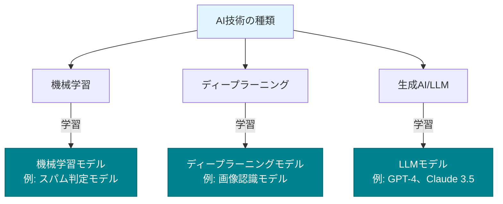
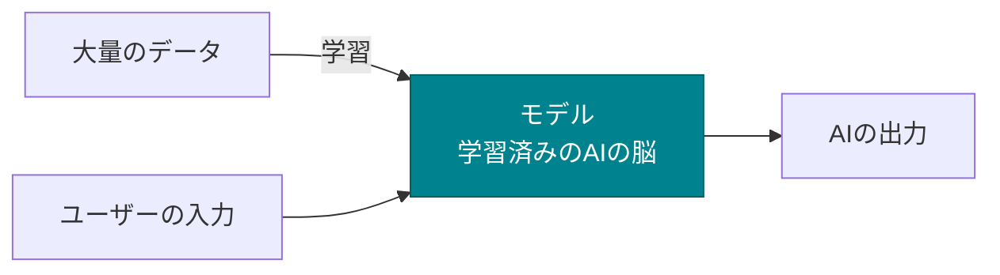
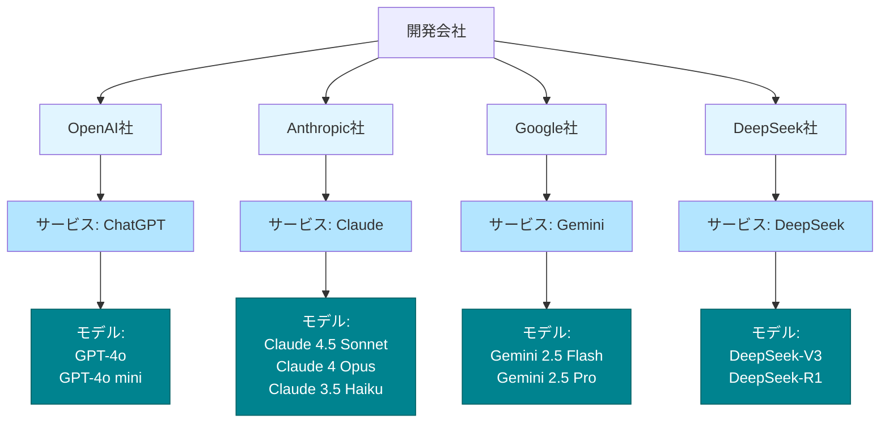

# モデルとは

ここまでAIの種類について学んできましたが、「モデル」という言葉も頻繁に耳にします。この「モデル」とは何でしょうか？

## モデルは「学習済みのAIの脳」

**モデル（Model）** とは、大量のデータで学習を完了したAIのことです。言い換えれば、「AIの脳」です。

先ほど説明した「機械学習」「ディープラーニング」「生成AI」「LLM」は**技術の種類**でした。一方、「モデル」はこれらの技術を使って**学習を行ったAI**です。

## モデルの作成プロセス

例えば、ChatGPTで使われている「GPT-4o」は、インターネット上の膨大なテキストデータで学習を完了したモデルです。このモデルがあるからこそ、私たちの質問に答えたり、コードを生成したりできます。

## 会社・サービス・モデルの関係

ここで、AI開発を行っている会社と、そのサービス、モデルの関係を整理しておきます。

**OpenAI社**
- **会社名**：OpenAI
- **サービス名**：ChatGPT、GitHub Copilot
- **モデル名**：GPT-4o、o1、GPT-4o miniなど

**Anthropic社**
- **会社名**：Anthropic
- **サービス名**：Claude
- **モデル名**：Claude 3.5 Sonnet、Claude 3 Opusなど

**Google社**
- **会社名**：Google
- **サービス名**：Gemini
- **モデル名**：Gemini 2.0 Flash、Gemini 1.5 Proなど

**DeepSeek社**
- **会社名**：DeepSeek
- **サービス名**：DeepSeek
- **モデル名**：DeepSeek-V3、DeepSeek-R1など

## モデルの種類

モデルには大きく分けて3つのタイプがあります。

### モデルの3つのタイプ

モデルは、性能・速度・コストの特徴によって3つのタイプに分類できます。

| タイプ | 特徴 | 性能 | 速度 | コスト | 主な用途 | 各社のモデル |
|--------|------|------|------|--------|----------|--------------|
| **Thinking （思考型）** | 深く考えて正確な答えを出すが遅い | ⭐⭐⭐⭐⭐ | ⭐⭐ | 高い | 複雑なコード生成 難しいバグ修正 設計の相談 | **OpenAI**: o1 **Anthropic**: Claude 4 Opus **Google**: Gemini 2.5 Pro **DeepSeek**: DeepSeek-R1 |
| **Balanced （バランス型）** | 性能・速度・コストのバランス型 | ⭐⭐⭐⭐ | ⭐⭐⭐ | 中程度 | 通常のコード生成 リファクタリング ドキュメント作成 | **OpenAI**: GPT-4o **Anthropic**: Claude 4.5 Sonnet **DeepSeek**: DeepSeek-V3 |
| **Fast （高速型）** | 安くて速度重視だが精度が甘い | ⭐⭐⭐ | ⭐⭐⭐⭐⭐ | 低い | コードの説明 簡単な質問 コメント生成 | **OpenAI**: GPT-4o mini **Anthropic**: Claude 3.5 Haiku **Google**: Gemini 2.5 Flash |

### どのモデルを選ぶべきか

タスクに応じて、以下のように使い分けます。

**Thinkingモデルを使う場面**
- 複雑なアルゴリズムの実装
- 難しいバグの原因究明
- アーキテクチャ設計の相談
- セキュリティの脆弱性分析

**Balancedモデルを使う場面**
- 通常のコード生成

**Fastモデルを使う場面**
- 簡単な質問
- コメントの生成
- 変数名の提案

## なぜモデルを理解する必要があるのか

AI駆動開発では、**適切なモデルを選ぶこと**が重要です。

モデルの特徴を理解することで、タスクに応じて最適なAIを選択でき、開発効率とコストのバランスを取れます。
