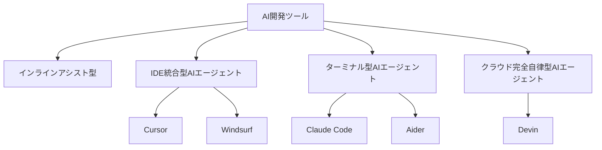

# 主要なAI開発ツールとおすすめのエディタ

この章では、AI駆動開発を実現する主要なツールを紹介します。それぞれのツールの特徴を理解して、あなたの開発スタイルに合ったツールを見つけてください。

## 開発でChatGPTを使うのは卒業しよう

まず、多くの人が最初に使うであろう「ChatGPT」などのLLM（大規模言語モデル）について触れておきます。

### ChatGPTでもコーディングはできるが...

ChatGPTを使って、こんな経験をした方も多いのではないでしょうか。

```
あなた：「Pythonでファイルを読み込むコードを書いて」
ChatGPT：「以下のようなコードで読み込めます。（コードを提示）」
あなた：（コピー＆ペーストして実行）
```

確かに、ChatGPTは質問に答えてコードを生成してくれます。調べ物をしたり、簡単なコードを生成するには便利です。

### ChatGPTの限界：開発ツールとしては手間がかかりすぎる

しかし、実際の開発でChatGPTを使うと、こんな問題に直面します。

**問題1：プロジェクトのコンテキストを理解できない**

ChatGPTはあなたのプロジェクトのファイルを読めません。毎回ファイルの内容をコピー＆ペーストして伝える必要があり、とても手間がかかります。

→ **AI開発ツールなら**：プロジェクトのファイルを自動で読み取り、全体のコンテキストを理解した上でコードを生成してくれます。

**問題2：ファイルを直接編集できない**

ChatGPTはコードを提示するだけです。実際にファイルに反映するのは、あなたが手作業で行う必要があります。複数ファイルの修正が必要な場合、1つ1つコピー＆ペーストする必要があります。

→ **AI開発ツールなら**：複数ファイルを自動で編集してくれます。あなたがファイルを開いて手作業で反映する必要はありません。

**問題3：コードを実行できない**

ChatGPTは実際にコードを実行できません。エラーが出るたびに、エラーメッセージをコピー＆ペーストして質問し、修正案をもらい、また手動で反映する...という往復が必要です。

→ **AI開発ツールなら**：コードを実行してエラーを確認し、自分で修正を試みてくれます。エラーが出ても、自律的にデバッグを進めてくれます。

つまり、**ChatGPTは「提案」はしてくれますが、「実行」はしてくれない**のです。

## ChatGPTは「質問ツール」としては優秀だが、開発のメインとしては物足りない

誤解しないでほしいのは、ChatGPTが悪いツールというわけではありません。

**ChatGPTが向いていること：**
- 技術的な質問への回答
- アルゴリズムの説明
- コードの解説
- 設計の相談
- エラーメッセージの意味を理解する

しかし、**実際の開発作業を進めるツールとしては、正直物足りない**のです。

### もっと良いツールがある

そこで登場するのが、この章で紹介する「AI開発ツール」です。これらのツールは：

- **プロジェクトのコードを自動で理解する**
- **複数ファイルを同時に編集できる**
- **コードを実行してエラーを確認できる**
- **Git操作やテスト実行も自動化できる**

つまり、「質問に答える」だけでなく、「実際に開発作業を進める」ことができます。

それでは、これらのツールを見ていきましょう。

## AI開発ツールの全体像

AI開発ツールは、大きく4つのカテゴリに分けられます。



それぞれのカテゴリは、**自律性の高さ**と**実行できる作業範囲**が異なります。

## 1. インラインアシスト型

### 特徴

インラインアシスト型は、あなたが書く1行1行をリアルタイムでアシストしてくれるツールです。自律性は低く、あなたが主導権を持って開発を進めます。

**動作イメージ：**
```javascript
// あなたがコメントを書くと...
// ユーザーの年齢が20歳以上かチェックする関数

// ↓ AIが次のようなコードを提案
function isAdult(age) {
  return age >= 20;
}
```

あなたがコードを書いている最中に、AIがリアルタイムで次のコードを予測して提案します。提案を受け入れるかどうかは、あなたが決めます。

### インラインアシスト型は古くて非効率なので非推奨

インラインアシスト型は、AI駆動開発の初期段階で登場したツールですが、現在ではより高機能なツールが登場しているため、お勧めできません。

お勧めなのは、これから紹介する「IDE統合型AIエージェント」や「ターミナル型AIエージェント」といったツールです
## 2. IDE統合型AIエージェント(Curosrなど)

### 特徴

エディタ内で動作し、複数のファイルを同時に編集できるAIエージェントです。自律性は中程度で、あなたがAIと対話しながら開発を進めます。

**動作イメージ：**
```
あなた：「ユーザー認証機能を追加して」

AIエージェント：
  1. auth.jsファイルを作成
  2. login.jsファイルを作成
  3. データベーススキーマを更新
  4. テストファイルを作成
  5. 「認証機能を追加しました」と報告
```

エディタ内でAIと対話しながら、複数のファイルを編集できます。あなたはエディタの操作感を保ったまま、AIの力を活用できます。

### こんな人に向いている

- 既存のエディタ感覚でAIの力を使いたいエンジニア
- 複数ファイルを同時に編集したい
- コードを見ながらAIと対話したい

### 代表的なツール

#### Cursor

**特徴：**
- VS Codeベースで使い慣れた操作感
- 最も人気のあるAI統合エディタ
- 複数ファイルの同時編集が可能
- コードベース全体を理解して提案

**価格：**
- 無料プランあり（制限付き）
- Proプラン：$20/月

**何ができるか：**
- AIとのチャット形式での対話
- 複数ファイルの同時編集
- コードの説明と改善提案
- バグの検出と修正
- リファクタリング

#### その他のツール

この種のツールとして、他には、Windsurf, Clineなどが挙げられます

## 3. ターミナル型AIエージェント(ClaudeCodeなど)

### 特徴

コマンドラインで動作するAIエージェントです。

「IDE統合型AIエージェント」がGUIのエディタなのに対し、こちらはターミナル上で動作する違いがあります。

### こんな人に向いている

- ターミナル作業が多いエンジニア
- 自動化を重視する人
- エディタを開かずにコードを編集したい
- CIツールやスクリプトと組み合わせたい

### 代表的なツール

#### Claude Code

**特徴：**
- Anthropic社が提供するターミナル型AIエージェント
- 最も注目されているAIコーディングツールの一つ

**価格：**
- 月3000円程度〜

#### その他のツール

この種のツールとして、他には、Aider, Gemini CLIなどが挙げられます


## 4. クラウド完全自律型AIエージェント(Devinなど)

### 特徴

**AIを仮想エンジニアとして雇うようなツール**です。
実際のエンジニアがやるような作業をクラウド上で自律的に実行します。

ユーザーがブラウザ上で指示を出すと、クラウド上で開発環境が自動作成され、完全に自律して開発を進めます。

あなたはローカルに開発環境を作る必要すらありません。タスクを指示するだけで、AIがクラウド上で自律的にコーディング、テスト、デバッグなどを行います。

**動作イメージ：**
```
あなた：「このバグを調査して修正して」

AIエージェント（Devin）：
  1. コードベースを調査
  2. バグの原因を特定
  3. テストを作成
  4. コードを修正
  5. テストを実行
  6. プルリクエストを作成
  7. 「修正が完了しました」と報告
```

**特徴：**
- **汎用的**：どんなプロジェクト、どんな技術スタックでも対応
- **既存プロジェクトに対応**：新規開発だけでなく、既存コードの修正やバグ修正もできる
- **エンジニアの代替**：実際のエンジニアがやるような作業をクラウド上で自律的に実行
- **高価格**：プロのエンジニアを雇うイメージ

### こんな人に向いている

- 実務レベルの開発をAIに任せたい
- 既存プロジェクトのバグ修正や機能追加を自動化したい
- どんな技術スタックでも対応してほしい
- 複雑なプロジェクトを自動化したい

### 代表的なツール

#### Devin

**特徴：**
- Cognition AI社が提供するAIソフトウェアエンジニア
- 最も有名な完全自律型AIエージェント
- 独自のブラウザ、ターミナル、エディタを持つ
- 複雑なタスクを完全自律で実行

**価格：**
- 月3000円程度〜
- すぐクレジットを使い切ってしまうので、実質は割高な印象


**何ができるか：**
- プロジェクトの計画立案
- コードベースの作成
- テストの実装と実行
- バグの検出と修正
- デプロイ
- ドキュメント作成

---
## GitHub Copilotについて

有名なAIツールの１つとして、github copilotというツールもあります

これは当初、インラインアシスト型のツールとして誕生しました

現在では、VSCodeエディタのプラグインとして、CurosorのようにIDE統合型エージェントとしても使用することができます。Cursorと並んで、とてもおすすめです

また、Devinのように、クラウド上でタスクを実行してくれるエージェント機能もあります。 
具体的には、GitHubのIssueに対して、AIがクラウド上でプルリクエストを作ってくれるような機能です。

このように、ひとくちにgithub copilotと言っても、多様な機能を持っているAIツールもあることを覚えておきましょう

github copilotは今後、最も普及する可能性のある、とてもおすすめなAIツールの１つです

---

## どのツールを選べばいいか

2025年時点での結論：**CursorとClaude Codeの2つがおすすめです。**

### 推奨する学習ステップ

まずは**Cursor**でAI駆動開発に慣れてから、より自律性の高い**Claude Code**を試す流れにしましょう。

#### ステップ1：Cursorから始める

Cursorは、AI駆動開発の入り口として最適です。

- VS Codeと同じ操作感なので学習コストが低い
- エディタの中でAIと対話できるので安心感がある
- 複数ファイルの編集を体験できる
- 自分のペースで開発を進められる

**Cursorで慣れること：**
- AIに指示を出す感覚
- プロジェクト全体のコンテキストをAIが理解すること
- 複数ファイルを同時に編集する体験

#### ステップ2：Claude Codeに移行する

Cursorに慣れたら、Claude Codeを試してみましょう。

- CIツールとの統合：スクリプトやワークフローと組み合わせやすい
- より高い自律性：使い方によっては、人間の確認なしで完全に自動化できる

### その他のツールについて

#### Devinは高額でも良ければ検討の余地あり

Devinは、**月10万円以上の高額な費用を払っても良い方は検討の余地があります**。

**選択の基準：**

CursorやClaude Codeを使うか、Devinを使うかは、以下の要素で判断します。

- **運用フロー**：現場の開発フローにDevinがマッチするか
- **予算**：Devinを本格的に使うと月10万円以上はかかるが許容できるか

**個人的な見解：**

Devinは精度がまだ甘いため、個人的には2025年時点では**Claude Code or Cursorが最も良い選択**だと考えています。

- 自律性と精度のバランスが良い
- コストパフォーマンスが高い

ただし、これは現場ごとに判断すべき問題です。予算と運用フローに合わせて選択してください。

## まとめ

この章では、AI開発ツールの4つのカテゴリと代表的なツールを紹介しました。

- **インラインアシスト型**：リアルタイムでコード補完（GitHub Copilot、Codeium）
- **IDE統合型AIエージェント**：エディタ内でAIと対話しながら開発（Cursor、Windsurf）
- **ターミナル型AIエージェント**：ターミナルで自律的に開発（Claude Code、Aider）
- **クラウド完全自律型AIエージェント**：完全自律で開発を進める（Devin）

それぞれのツールは、自律性と作業範囲が異なります。あなたの開発スタイルやプロジェクトの要件に合わせて、適切なツールを選んでください。

