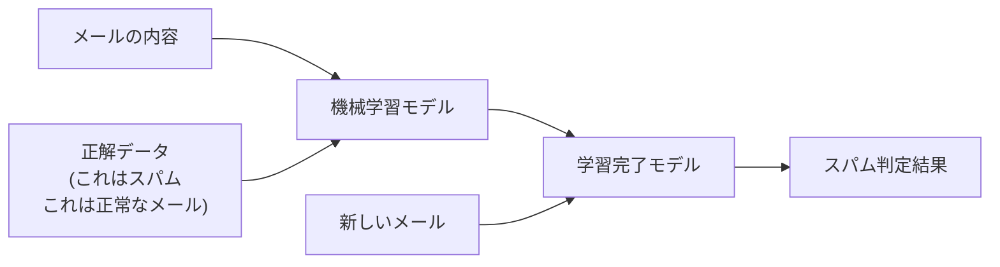

# 機械学習とは

機械学習（Machine Learning）とは、コンピュータが大量のデータからパターンや規則性を見つけ出して学習する技術です。

## 機械学習の3つの学習方法

機械学習には、大きく分けて3つの学習方法があります。

### 1. 教師あり学習

正解データとセットで学習する方法です。

例えば、スパムメール判定システムを作る場合、「これはスパム」「これは正常なメール」という正解データが付いたメールを大量に用意し、モデルに学習させます。

### 2. 教師なし学習

正解データなしで、データの中から特徴やグループを自動的に見つける方法です。

例えば、ECサイトの顧客データを分析して、似た購買行動をする顧客グループを自動的に分類します。「このグループは高価格商品を好む」「このグループは頻繁に購入する」といった特徴を、AIが自動的に発見します。

### 3. 強化学習

試行錯誤を繰り返して、最適な行動を学習する方法です。

「良い行動をしたら報酬を与え、悪い行動をしたらペナルティを与える」という方法で学習します。例えば、囲碁AIのAlphaGoは、何百万回もの対局を通じて強化学習で学習しました。
