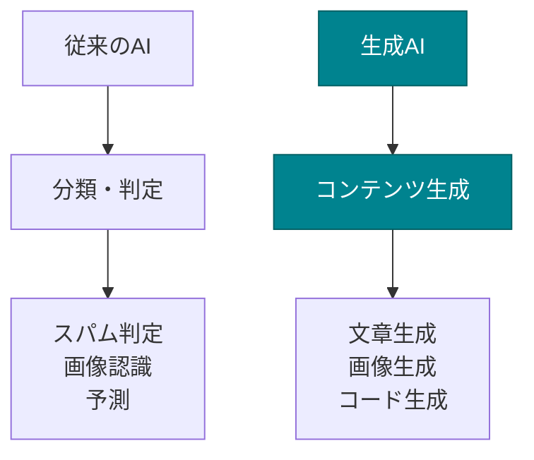

# 生成AIとは

生成AI（Generative AI）は、ディープラーニングを活用した技術の1つで、新しいコンテンツを生成することに特化したAIです。

## 従来のAIとの違い

**従来のAI**は、主に「分類」や「判定」を行っていました。

- スパムメールかどうかを判定する
- 画像に写っているものが猫かどうかを分類する
- 株価が上がるか下がるかを予測する

**生成AI**は、新しいコンテンツを生み出します。

- 文章を書く
- 画像を描く
- 音楽を作曲する
- プログラムコードを生成する

## 生成AIの種類

生成AIには、扱うコンテンツによって複数の種類があります。

### 1. テキスト生成AI

文章を生成します。ChatGPT、Claudeなどが代表例です。

- ブログ記事の執筆
- メールの下書き作成
- プログラムコードの生成
- ドキュメントの作成

### 2. 画像生成AI

画像を生成します。Stable Diffusion、Midjourney、DALL-Eなどが代表例です。

- プロンプト（文章での指示）から画像を生成
- 既存画像の編集や拡張
- デザイン案の作成

### 3. 音声生成AI

音声や音楽を生成します。

- テキストを自然な音声に変換
- 音楽の自動作曲
- 声質の変換
