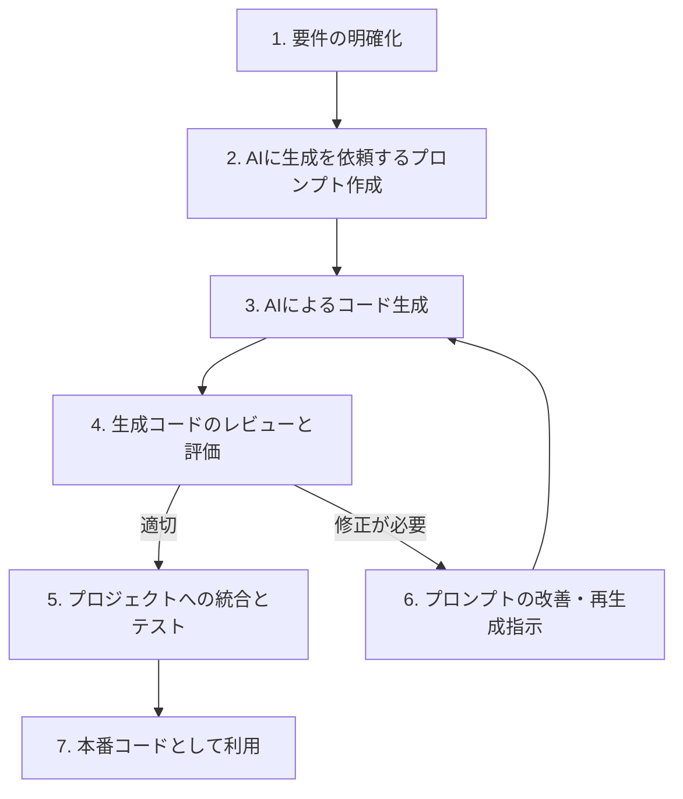
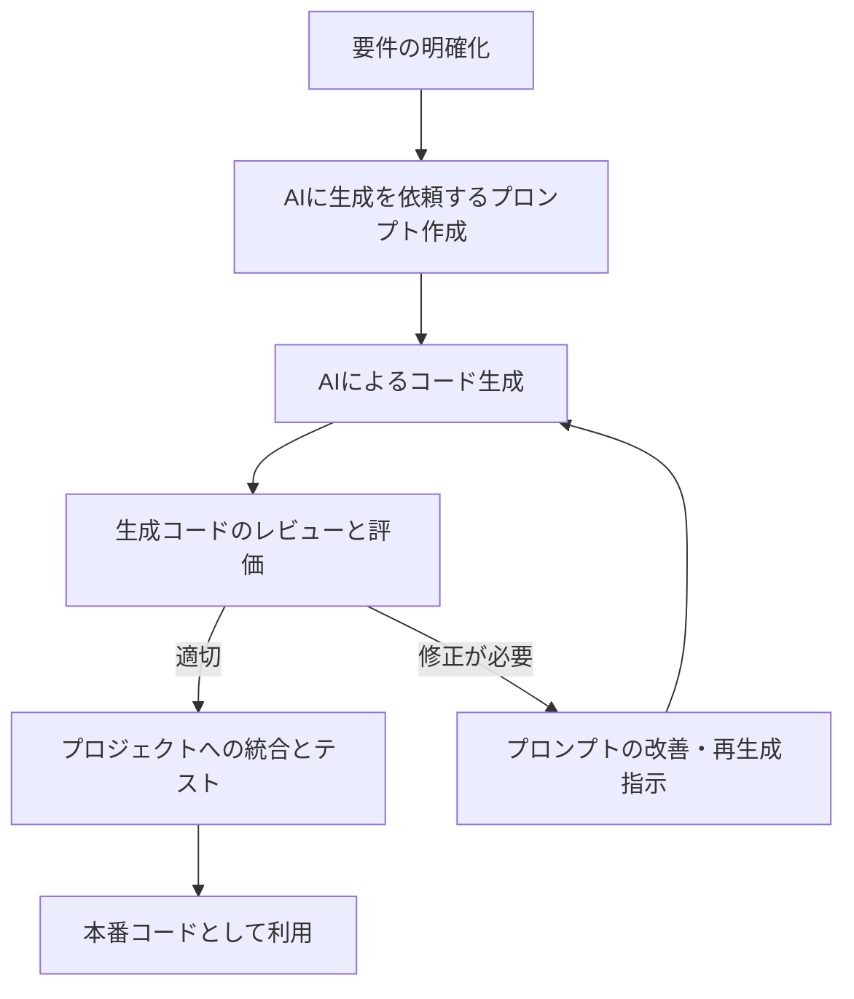

# カラーチャート

#8b008b
#800000

# Mermaid コードブロックの修正指示

以下の Mermaid コードブロックを修正してください：

1. ノード名から数字とドット（例：`1.`）を削除
2. 角括弧内のテキストのみを残す
3. 矢印やその他の構文はそのまま維持

修正前：

修正後：

同様の修正を他の Mermaid コードブロックにも適用してください。

---

# 改善点

- 表を使った方がわかりやすい部分は、表を活用してリライトしろ

あなたはAI駆動開発の書籍執筆のプロです。
以下のポイントを踏まえてリライトしろ

- 読者のことを呼ぶ必要がある場合は「あなた」と呼ぶ。（無理に呼ぶ必要は全くない）
- 開発者にとって従来の開発で苦労しているポイントについて共感を呼ぶような問題提起
- 従来の開発手法が抱える課題についてのみ、軽いブラックジョークを入れてもOK。ただし無駄に文が長くなったり、くどいジョークは絶対に避けること。多くても、１ページに３個まで。(必ずしも入れる必要は全くない)
- AIを使った開発に夢を見させるようなワクワクする未来を見せる

## 制約事項

- "ボイラープレートコード" というワードは禁止。単純に"ソースコード"と表現しろ

